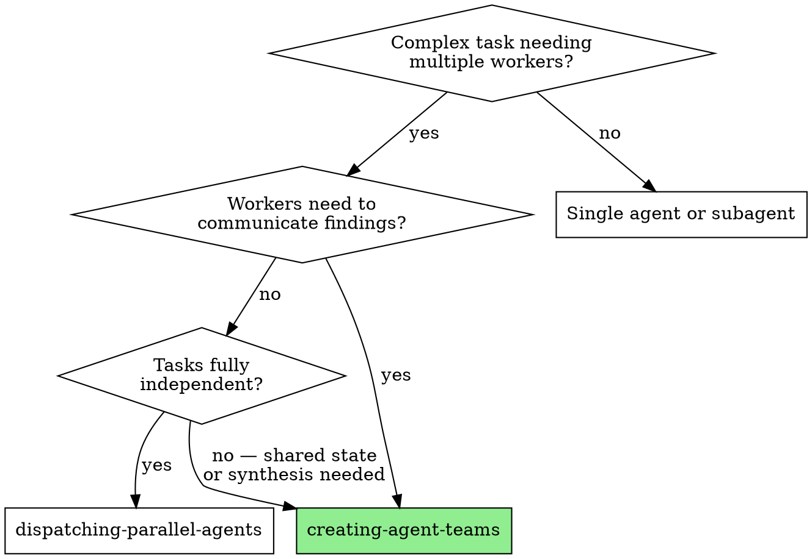

# Creating Agent Teams

Launch coordinated agent teams for tasks requiring persistent cross-talk, shared
state, and teammate lifecycle management.

**Trigger:** `/agent-team <task-description>` or `/agent-team`

## Arguments

- `$ARGUMENTS` — Free-text task description. If omitted, ask the user.
- `--scenario <name>` — Use a pre-built template from [scenarios.md](scenarios.md).
  Skips Phase 2 (team design). Still requires user approval before launching.
  Valid: `multi-model-eval`, `paper-assembly`, `failure-investigation`,
  `cross-model-taxonomy`, `post-batch-analysis`, `augmentation-audit`.
- `--teammates N` — Override default teammate count.
- `--no-critic` — Skip critic review (read-only/exploratory tasks only).
- `--fast` — Skip plan approval (urgent tasks only).

## When to Use



**Use agent teams when:**
- Teammates must share findings with each other (not just report to parent)
- One teammate's output feeds another's input (synthesis)
- Extended work (~5-30 min per teammate) with context accumulation
- Shared task list tracking is needed

**Don't use when:**
- Tasks are fully independent → use `dispatching-parallel-agents`
- Quick structured verdicts (~30s-2min) → use subagents
- Single-file edits → teammate overhead exceeds benefit
- Eval batches in worktrees → submodules won't initialize
- Two teammates would edit the same file → overwrite conflicts

## Workflow

### Phase 1: Understand the Task

1. Parse `$ARGUMENTS` for what the team should accomplish.
2. If unclear, ask Samyak for clarification.
3. Identify files, systems, and scope involved.
4. If `--scenario` used, load template from [scenarios.md](scenarios.md), skip to Phase 3.

### Phase 2: Design the Team

1. Determine minimum teammates (prefer fewer, focused teammates).
2. For each teammate define:
   - **Name** — descriptive, lowercase-with-hyphens
   - **Role** — one sentence
   - **Scope** — specific files/areas they own (NO overlap between teammates)
   - **Skills/Agents** — which pre-made agents or skills they should use
3. Present to Samyak:

```
## Proposed Team: <team-name>

| Teammate | Role | Scope | Skills/Agents |
|----------|------|-------|---------------|
| planner  | ... | ... | /writing-plans |
| ...      | ... | ... | ... |
| critic   | ... | ... | self-critic |

Estimated cost: ~Nx (see Cost table below)
```

4. **Wait for Samyak's approval.** Do NOT proceed until approved.

### Phase 3: Create and Launch

Execute these steps in exact order:

**Step 1 — TeamCreate.** Always the first action.
```
TeamCreate(team_name="<descriptive-name>")
```
If you find yourself about to call Agent without `team_name`, STOP.
Agent calls without `team_name` create isolated subagents that cannot cross-talk,
do not appear as teammates, and miss all coordination benefits.

**Step 2 — Create tasks** with TaskCreate for each unit of work.

**Step 3 — Compose teammate prompts.** For EVERY teammate:
1. Read [teammate-prompt.md](teammate-prompt.md)
2. Fill in ALL `[FILL]` placeholders with the teammate's specific scope, skills, etc.
3. Append the teammate's task description after the directives block

**Step 4 — Spawn teammates** with Agent tool:
```
Agent(
  prompt="<filled teammate-prompt.md>\n\n## YOUR TASK\n<task description>",
  model="opus",
  team_name="<team-name-from-step-1>",
  name="<teammate-name>"
)
```
Every `Agent` call MUST include `team_name`.

**Step 5 — Manage lifecycle:**
- Assign tasks as teammates become available
- Aggregate results and present to Samyak
- Escalate decisions to Samyak (teammates don't contact user directly)
- Watch for handoff signals (teammate-prompt.md Section 5)
- When a teammate signals context relay: spawn child, pass handoff summary, confirm
- Shut down teammates when their work is done

### Phase 4: Quality Gate

Skip this phase only if `--no-critic` was specified.

1. **Critic reviews ALL changes** by other teammates. Checks:
   - Factual accuracy — claims match actual data files
   - Stale references — files, functions, numbers that don't exist
   - Consistency — no contradictions between teammate outputs
   - Completeness — all assigned tasks actually done
   - Scope compliance — no unauthorized file changes

2. Present critic findings to Samyak.

3. If issues found → fix loop:
   a. Plan which teammate owns the fix
   b. Get Samyak's approval
   c. Teammate implements fix
   d. Critic re-reviews
   e. Max 3 iterations, then escalate to Samyak

4. Final report to Samyak:
   - What was done (with file paths)
   - What decisions were made (and why)
   - What files were changed
   - Any open items or concerns

## Available Agents & Skills for Teammates

Teammates should reuse these rather than building from scratch:

| Agent/Skill | Use for |
|------------|---------|
| `explorer` agent | Read-only codebase exploration |
| `paper-drafter` agent | Writing paper sections (always reads data first) |
| `eval-batcher` agent | Running LLM evaluation batches |
| `spec-auditor` agent | Auditing spec JSON files |
| `plan-reviewer` agent | Adversarial plan review |
| `self-critic` agent | Adversarial self-review |
| `consistency-checker` agent | Cross-checking docs vs code |
| `/writing-plans` skill | Creating implementation plans |
| `/validate` skill | Post-session validation |
| `/review` skill | Multi-agent code review |

## Cost Estimation

| Team Size | Token Multiplier | When to Use |
|-----------|-----------------|-------------|
| Lead + 1 | ~2x | Simple comparison tasks |
| Lead + 2 | ~3x | Most analysis (paper, debugging) |
| Lead + 3 | ~4x | Multi-model analysis |
| Lead + 4+ | ~5x+ | Rare; 4+ model comparison only |

All teammates use Opus (`model: "opus"`).

## Known Limitations

- **Delegate mode bug:** Teammates may not receive all tool results. Workaround:
  `claude --teammate-mode in-process`.
- **Worktrees + submodules:** Teammates in worktrees can't access benchmark sources.
  Never run eval-related teammates in worktrees.
- **File conflicts:** Two teammates editing the same file causes overwrites. Assign
  explicit file ownership in Phase 2.
- **Context exhaustion:** Large directories (160+ files) fill context fast. Teammates
  MUST follow the context relay protocol in [teammate-prompt.md](teammate-prompt.md) Section 5.

## Controls Cheat Sheet

| Action | How |
|--------|-----|
| Cycle through teammates | `Shift+Down` |
| View a teammate's session | `Enter` on selected |
| Message teammate directly | Type while viewing |
| Return to lead | `Escape` |
| Toggle shared task list | `Ctrl+T` |
| Shut down one teammate | Tell lead: "Ask {name} to shut down" |
| Clean up entire team | Tell lead: "Clean up the team" |
| Force in-process mode | `claude --teammate-mode in-process` |

## Example: Appendix Figures Team

**Task:** "Add figures from `analysis/visualizations/` into the paper appendix,
using data from `analysis/data/`, with `/writing-plans` and `paper-drafter` agent."

**Phase 2 output:**
```
## Proposed Team: appendix-figures

| Teammate    | Role                    | Scope                              | Skills/Agents    |
|-------------|-------------------------|--------------------------------------|------------------|
| planner     | Plan appendix structure | analysis/visualizations/, analysis/data/, docs/paper/appendix_*.md | /writing-plans |
| writer      | Draft appendix content  | docs/paper/appendix_*.md             | paper-drafter    |
| critic      | Review accuracy         | All teammate outputs (read-only)     | self-critic      |

Estimated cost: ~3x
```

**Phase 3:** TeamCreate → TaskCreate (3 tasks) → Spawn planner with filled
teammate-prompt.md → Planner produces plan → Samyak approves → Spawn writer
with plan + teammate-prompt.md → Writer drafts appendix sections → Spawn critic
→ Critic reviews → Present findings → Done.
