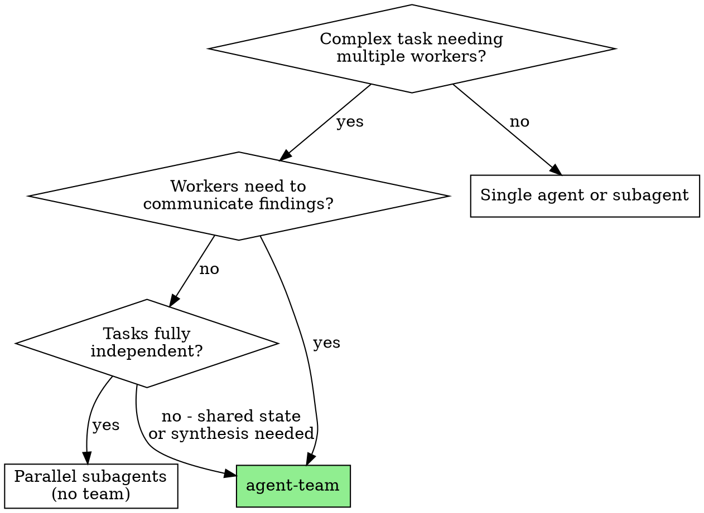

# agent-team

Launch coordinated agent teams for tasks that need persistent cross-talk, shared state, and teammate lifecycle management.

**Trigger:** `/agent-team <task-description>`

## Arguments

- `$ARGUMENTS` - free-text task description. If omitted, ask the user.
- `--scenario <name>` - use a pre-built template from [scenarios.md](scenarios.md). Skips Phase 2 (team design), still requires user approval before launching. Valid: `feature-implementation`, `failure-investigation`, `documentation-assembly`, `multi-system-analysis`.
- `--teammates N` - override the default teammate count.
- `--advisor` - add a read-only strategic advisor teammate as a peer reviewer (see Phase 3, Step 2.5). Off by default.
- `--no-critic` - skip the critic quality gate. Read-only or exploratory tasks only.
- `--fast` - skip plan approval. Urgent tasks only.

## Model policy

Every teammate runs Opus. Effort is the dial, not the model: xhigh for the advisor, planners, and critics; medium to high for execution workers.
Sonnet is permitted only for a **mechanical subagent** a teammate spawns underneath itself - bulk file reads, greps, listings, mechanical rewrites with no judgment in them.
Never Haiku, for anything.

There is no cheap-worker tier here, so the cost of a team is roughly linear in teammate count. That is the reason the decision graph below pushes you toward the smallest team that can do the job, and toward no team at all when the work is separable.

## When to use



**Use an agent team when:**

- Teammates must share findings with each other, not just report up to the parent.
- One teammate's output feeds another's input (synthesis).
- The work is extended (roughly 5-30 minutes per teammate) with context accumulation.
- A shared task list needs to track progress across the group.

**Do not use a team when:**

- The tasks are fully independent. Dispatch parallel subagents instead.
- You want a quick structured verdict (30 seconds to 2 minutes). Use one subagent.
- The change is a single file. Teammate overhead exceeds the benefit.
- Two teammates would edit the same file. That produces overwrite conflicts, not collaboration.

## Workflow

### Phase 1: Understand the task

1. Parse `$ARGUMENTS` for what the team should accomplish.
2. If it is unclear, ask the user.
3. Identify the files, systems, and scope involved.
4. If `--scenario` was given, load the template from [scenarios.md](scenarios.md) and skip to Phase 3.

### Phase 2: Design the team

1. Determine the minimum number of teammates. Prefer fewer, more focused teammates.
2. For each teammate define:
   - **Name** - descriptive, lowercase-with-hyphens, unique in the session.
   - **Role** - one sentence.
   - **Scope** - the specific files or areas it owns, with NO overlap between teammates.
   - **Skills/Agents** - which pre-made agents or skills it should use.
3. All teammates run Opus (see Model policy). Set effort per role rather than downgrading a model.
4. Present the proposal to the user:

```
## Proposed Team: <team-name>

| Teammate    | Effort | Role | Scope | Skills/Agents |
|-------------|--------|------|-------|---------------|
| planner     | xhigh  | ...  | ...   | /writing-plans |
| implementer | high   | ...  | ...   | ...            |
| critic      | xhigh  | ...  | All teammate outputs (read-only) | /plan-review |

Estimated cost: ~Nx a single session (N = teammate count; see Cost below)
```

5. **Wait for user approval.** Do not proceed until approved.

### Phase 3: Create and launch

**Step 1 - how teams form.** There is no team-creation call.
A team forms implicitly the moment you spawn the first teammate; it is auto-named per session and cleaned up automatically on session exit.
The one durable invariant: spawn every teammate with a unique `name`.
The unique name is what makes it an addressable teammate you can message and what puts it in the shared task list.
Spawn teammates via the session's current spawn mechanism (the `Agent` tool with a `name`, or the equivalent in your harness), and consult the live `Agent` / `SendMessage` tool schema and https://code.claude.com/docs/en/agent-teams for the exact form.
Do not hard-code a tool-call recipe here; it changes between releases. `team_name` is deprecated and ignored.

**Step 2 - create tasks** with the task tool for each unit of work.

**Step 2.5 - spawn the advisor first** (only if `--advisor` was given): spawn a teammate named `advisor` using [advisor-prompt.md](advisor-prompt.md) with every `[FILL]` placeholder filled.
Wait for the advisor's "ADVISOR READY" message before spawning any workers.

**Step 3 - compose teammate prompts.** For every worker and critic:

1. Read [teammate-prompt.md](teammate-prompt.md).
2. Fill in every `[FILL]` placeholder with that teammate's scope, skills, and file ownership.
3. Append the teammate's task description after the directives block.

**Step 4 - spawn workers.** Spawn each worker and the critic with a unique `name` and its filled prompt plus task description.
All run Opus; set effort per role.

**Step 5 - manage the lifecycle:**

- Assign tasks as teammates become available.
- Aggregate results and present them to the user.
- Escalate decisions to the user. Teammates do not contact the user directly.
- Watch for handoff signals (teammate-prompt.md Section 5).
- When a teammate signals a context relay: spawn the child, pass the handoff summary, confirm.
- Shut teammates down when their work is finished.

**Advisor coordination** (only when `--advisor` is active):

1. After each worker milestone, forward the summary to the advisor.
2. Relay the advisor's guidance back to the relevant worker.
3. If a worker is stuck after two failed attempts, escalate to the advisor.
4. Before Phase 4, send the advisor a `PRE-REVIEW:` message summarizing all the work.
5. During an advisor relay handoff, pause milestone forwarding until the replacement advisor signals READY.

### Phase 4: Quality gate

Skip this phase only if `--no-critic` was given.

1. **The critic reviews all changes** made by the other teammates, checking:
   - Factual accuracy: claims match the actual files and data.
   - Stale references: files, functions, or numbers that do not exist.
   - Consistency: no contradictions between teammate outputs.
   - Completeness: every assigned task is actually done.
   - Scope compliance: no unauthorized file changes.
2. If `--advisor` is active, send the advisor any cross-cutting or borderline findings for arbitration before reporting.
3. Present the critic's findings (plus advisor arbitration if any) to the user.
4. If issues were found, run the fix loop: decide which teammate owns the fix, get user approval, have that teammate implement it, have the critic re-review. Maximum 3 iterations, then escalate to the user.
5. Final report to the user:
   - What was done, with file paths.
   - What decisions were made, and why.
   - What files changed.
   - Any open items or concerns.

## Agents and skills teammates should reuse

Teammates reuse what exists rather than building from scratch. Adapt this list to whatever the project actually has installed:

| Agent/Skill | Use for |
|-------------|---------|
| A read-only explore agent | Codebase exploration without edit risk |
| A plan-reviewer agent | Adversarial plan or spec review |
| A self-critic agent | Adversarial review of the team's own output |
| A consistency-checker agent | Cross-checking docs against code |
| `/writing-plans` | Turning an approved design into an implementation plan |
| `/validate` | Pre-commit validation |
| `/code-review` | Multi-agent review of the diff |

## Cost

Every teammate is an Opus session, so a team of N costs roughly N times a single session, plus the cross-talk overhead of relaying messages between teammates.

| Team size | Rough multiplier | When it is worth it |
|-----------|------------------|---------------------|
| Lead + 1  | ~2x  | A task with one genuine adversarial counterpart |
| Lead + 2  | ~3x  | Most analysis and debugging work |
| Lead + 3  | ~4x  | Multi-system analysis |
| Lead + 4+ | ~5x+ | Rare; large-scale comparison only |

The multiplier is the reason to reach for teams last.
If the same result is reachable with one session and a few subagents, that is the correct choice.

## Known limitations

For the current authoritative limitations of agent teams (session resumption, task-status lag, one team per session, no nested teams), see https://code.claude.com/docs/en/agent-teams.
Those move between releases and are deliberately not transcribed here. Two durable caveats:

- **File conflicts.** Two teammates editing the same file causes overwrites. Assign explicit file ownership in Phase 2.
- **Context exhaustion.** Large directories fill context fast. Teammates must follow the context relay protocol in [teammate-prompt.md](teammate-prompt.md) Section 5.

## Controls

Keyboard controls for selecting a teammate, viewing its session, messaging it, and toggling the shared task list change between releases.
See the controls reference at https://code.claude.com/docs/en/agent-teams for the current keys.

Durable behavior, stable across releases:

- Teammates stay running and addressable while idle. Idle rows may auto-hide in the UI, but the teammate is alive and can be messaged.
- Team cleanup is automatic on session exit. There is no manual cleanup step.
- To stop a single teammate, tell the lead in natural language ("ask `<name>` to shut down").
