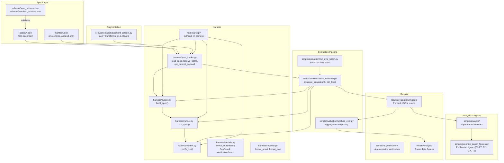
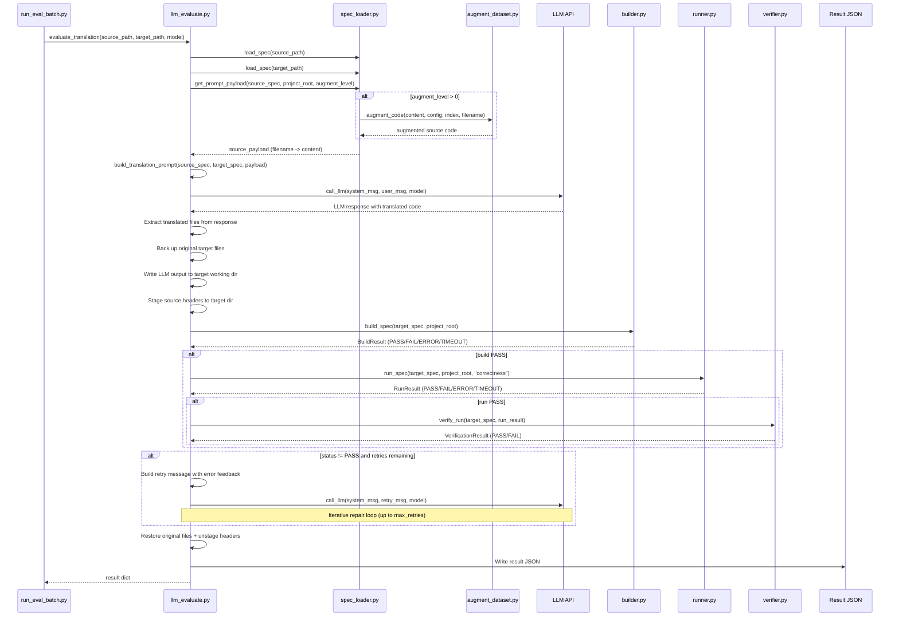

<!-- generated-by: gsd-doc-writer -->
# Architecture

## System Overview

ParBench is a benchmark framework for evaluating LLM-based parallel code translation across CUDA, OpenMP, and OpenCL. It takes declarative JSON spec files as input -- each defining a kernel variant's source code, build commands, run arguments, and verification strategies -- feeds source code to LLMs with a translation prompt, then runs the translated output through a build-run-verify pipeline to determine functional correctness. The architecture follows a spec-as-contract pattern: JSON specs are the single source of truth that drive every stage of the pipeline, from prompt assembly through result recording. Results are written as immutable, append-only JSON files that support reproducible analysis and paper-ready reporting.



## Data Flow

The following sequence diagram shows how a single LLM translation evaluation flows through the system -- from spec loading through LLM call to final result recording.



## Components

### Spec Layer (`specs/`, `manifest.jsonl`, `schema/`)

The spec layer is the foundation of ParBench. It depends on nothing else and is consumed by every other layer.

**Spec files** (`specs/*.json`, 206 files): Each JSON file is a declarative contract that fully describes a single kernel variant. Specs follow the naming pattern `{suite}-{kernel}-{api}.json` (e.g., `rodinia-bfs-cuda.json`). The schema (`schema/spec_schema.json`) enforces required top-level sections:

| Section | Purpose |
|---------|---------|
| `identity` | `kernel_name`, `parallel_api`, `unique_id`, `source_suite` |
| `provenance` | Repository URL, commit hash, source path for reproducibility |
| `files` | `prompt_payload`, `support_files`, `verification_only`, `translation_targets` |
| `implementation` | Language (C/C++), API, API version |
| `build` | Build system, working directory, commands (clean/configure/build), outputs |
| `run` | Executable, arguments, timeout, environment variables, input configurations |
| `verification` | Method, strategies (exit_code, stdout_pattern), floating-point tolerance |
| `hardware` | Target (gpu/cpu/both), requirements, reference platform |
| `baseline_results` | Recorded results from running the unmodified benchmark |

**Manifest** (`manifest.jsonl`, 211 entries): An append-only JSONL registry linking kernel names to spec files. Each line is a JSON object with `kernel_name`, `parallel_api`, `source_suite`, `category`, `spec_file`, and `source_dir`. The manifest enables translation pair discovery -- `find_translation_pairs()` in `spec_loader.py` enumerates all valid (source, target) API combinations for each kernel within a suite.

**Schemas** (`schema/`): JSON Schema files that validate spec structure (`spec_schema.json`), manifest entries (`manifest_schema.json`), and reference platform metadata (`reference_platform.json`). Validation is run via `scripts/validate_schema.py`.

### Harness (`harness/`)

The harness is a Python package that implements the build-run-verify pipeline. It is the "measurement instrument" -- given a spec, it compiles the kernel, runs it, and checks correctness.

**Modules:**

| Module | Key Functions | Purpose |
|--------|--------------|---------|
| `cli.py` | `main()`, `cmd_build()`, `cmd_run()`, `cmd_verify()`, `cmd_prompt()`, `cmd_info()`, `cmd_pairs()` | CLI entry point via `python3 -m harness`. Global flags (`-v`, `--json`, `--project-root`) must precede the subcommand. |
| `spec_loader.py` | `load_spec()`, `load_manifest()`, `resolve_paths()`, `get_prompt_payload()`, `find_translation_pairs()` | Loads specs, resolves relative paths to absolute using `config/paths.json`, reads source files for LLM prompts (with optional augmentation). |
| `builder.py` | `build_spec()` | Compiles a kernel: resolves working directory, runs optional clean/configure commands, substitutes `${VAR}` placeholders in build commands, executes the build, and verifies the executable exists. Returns `BuildResult`. |
| `runner.py` | `run_spec()`, `run_all_configurations()` | Executes a compiled kernel with arguments from a named input configuration (e.g., `"correctness"`). Optionally measures CPU time via `/usr/bin/time -v`. Returns `RunResult`. |
| `verifier.py` | `verify_run()`, `extract_metrics()` | Applies verification strategies in conjunction -- all non-SKIP strategies must PASS. Supports `exit_code` (check return code) and `stdout_pattern` (regex match on stdout). Returns `VerificationResult`. |
| `models.py` | `Status`, `BuildResult`, `RunResult`, `VerificationResult`, `MetricResult`, `SpecResult` | Data classes and the `Status` enum (`PASS`, `FAIL`, `ERROR`, `TIMEOUT`, `SKIP`). Pipeline stages return structured result objects rather than raising exceptions. |
| `reporter.py` | `format_result()`, `format_json()`, `print_spec_info()`, `print_prompt_payload()`, `print_translation_pairs()` | Formats pipeline results for human-readable or JSON output. |

**CLI subcommands:**

```
python3 -m harness build   specs/<name>.json    # Compile only
python3 -m harness run     specs/<name>.json    # Run only (skip build)
python3 -m harness verify  specs/<name>.json    # Full pipeline: build -> run -> verify
python3 -m harness prompt  specs/<name>.json    # Print what the LLM would see
python3 -m harness info    specs/<name>.json    # Print spec summary
python3 -m harness pairs                        # List all translation pairs
```

### Augmentation (`c_augmentation/`)

The augmentation module applies semantics-preserving AST transforms to C/C++/CUDA/OpenCL source code using libclang, creating syntactically diverse inputs for LLM evaluation. This tests whether LLMs are robust to surface-level code variations.

**Architecture:** The module uses a Strategy pattern. The abstract `Transform` base class defines `is_applicable()` and `apply()` methods. A level-based fraction control (`_select_fraction()`) determines how many candidates each transform rewrites, scaling from L1 (1 candidate) to L4 (all candidates). The `AstTransform` subclass adds AST-specific machinery including a `_greedy_valid_subset()` method that builds the largest non-overlapping candidate set.

**Concrete transforms** (in `c_augmentation/augment_dataset.py`):

| Transform Class | What It Does |
|----------------|--------------|
| `ArithmeticTransform` | Expands compound operators: `x += y` becomes `x = x + y` |
| `SwapCondition` | Flips comparison operands: `x < y` becomes `y > x` |
| `PointerArithmeticToArrayIndex` | Converts pointer arithmetic to array indexing: `*(arr + i)` becomes `arr[i]` |
| `TypedefExpansion` | Replaces typedef aliases with their underlying types |
| `ChangeNames` | Renames local variables to semantically neutral names |
| `ChangeFunctionNames` | Renames non-API functions |

**Level control:**

| Level | Fraction of candidates transformed |
|-------|-----------------------------------|
| L1 | 1 candidate (minimum) |
| L2 | 33% of candidates |
| L3 | 66% of candidates |
| L4 | 100% of candidates |

**Entry point:** `augment_code(code, config, index, filename)` in `augment_dataset.py`. Called by `harness/spec_loader.py:get_prompt_payload()` when `augment_level > 0`, and standalone via `scripts/augmentation/augment_verify.py`.

**Configuration:** `AugmentationConfig` dataclass holds the level, seed, transform list, and per-transform probability.

### Evaluation Pipeline (`scripts/evaluation/`)

The evaluation pipeline orchestrates LLM-based code translation and measures correctness.

**`llm_evaluate.py`** -- Per-task evaluation orchestrator:

- `build_translation_prompt()`: Assembles the system and user messages from source code, target infrastructure context, and translation instructions. Uses kernel-centric translation -- LLMs produce only kernel files (`files.translation_targets`), not the full project.
- `call_llm()`: Dispatches to the correct provider API based on `MODEL_REGISTRY`. Supported providers: Anthropic (`claude-*`), OpenAI (`gpt-*`, `o1-*`, `o3-*`, `o4-*`), Azure (`azure-*`), Groq (`groq-*`), Google Gemini (`gemini-*`), Together AI (`together-*`).
- `evaluate_translation()`: The main entry point. Loads specs, builds the prompt, calls the LLM, extracts translated files, writes them to the target working directory, runs build/run/verify, supports iterative repair (retry with error feedback on failure), then restores original files.
- `_is_kernel_only_translation()`: Detects OpenCL kernel-only translations (all `translation_targets` end with `.cl`) where host code is untouched.
- `_build_cross_api_run_spec()` / `_build_cross_api_verify_spec()`: Constructs run/verify specs for cross-API translations, handling the distinction between kernel-only and full-program translations.
- `analyze_build_failure()`: Parses linker errors and maps missing symbols to source file locations, enabling targeted retry feedback.
- `strip_think_tags()`: Removes `<think>...</think>` tags from model responses (used for models with chain-of-thought output like Qwen).
- `extract_code_blocks()`: Extracts fenced code blocks from LLM responses and maps them to expected target filenames.
- `backup_files()` / `restore_files()`: Manages file backup and restoration in the target working directory during evaluation, ensuring the original source is always recoverable.

**`run_eval_batch.py`** -- Batch orchestration:

- `_build_tasks()`: Reads the manifest, filters by suite/direction/kernels, and generates a task list of (source_spec, target_spec, model, augment_level, sample_id) tuples.
- `run_batch()`: Executes tasks sequentially with `--resume` support (skips existing results unless status is `ERROR` or `EXTRACTION_FAIL`). Writes per-task JSON results incrementally.
- Generates batch summary JSON and Markdown reports.

**`analyze_eval.py`** -- Results aggregation:

- Reads all per-task result JSONs under `results/evaluation/{model}/`.
- Produces `eval_summary.json` (machine-readable), `eval_summary.md` (publication-ready tables), and optionally `eval_results_data.js` (dashboard data).
- Supports complexity-aware reporting using `results/evaluation/translation_complexity.csv`.
- Excludes known-fail specs from aggregation.

**`reverify_pass_results.py`** -- Result re-verification:

- Re-verifies existing PASS evaluation results with corrected verification strategies (conjunction of stdout_pattern + exit_code). Records TRUE_PASS vs FALSE_PASS for each result.

### Analysis Pipeline (`scripts/analysis/`)

The analysis pipeline generates paper-ready data artifacts and statistical analyses from evaluation results.

| Script | Purpose |
|--------|---------|
| `generate_paper_data.py` | Generates data for paper figures and tables |
| `quantitative_findings.py` | Extracts and verifies quantitative claims for the paper |
| `benchmark_characterization.py` | Characterizes kernel properties (SLOC, complexity, API features) |
| `build_error_taxonomy.py` | Classifies build/run failure modes into a taxonomy |
| `statistical_analysis.py` | Statistical significance tests on evaluation results |
| `classify_translation_pairs.py` | Classifies translation pairs by complexity (`single_file`, `multi_to_single`, etc.) |
| `token_analysis.py` | Analyzes LLM token usage across tasks |
| `selfrepair_analysis.py` | Analyzes iterative repair (self-repair) effectiveness |
| `sloc_analysis.py` | Source lines of code analysis for kernel variants |
| `augmentation_analysis.py` | Per-kernel augmentation status matrices and pattern classification |
| `generate_results_matrix.py` | Generates combined results matrices across batches |
| `generate_report.py` | Produces pilot summary reports from spec data |
| `validate_characterization.py` | Validates benchmark characterization data |

Each analysis script has a corresponding test file (`test_*.py`) in the same directory for validation.

**Figure generation** (`scripts/generate_paper_figures.py`):

A unified script that generates all publication-quality figures for the SC26 paper using matplotlib. Produces main-body figures (F2--F7), appendix figures (C.1--C.4), and the LaTeX model-comparison table (T2). Outputs are written to `docs/paper/figures/` in both PDF and PNG formats (13 PDF + 13 PNG + 1 `.tex` + 1 `.drawio`). Additional augmentation figures (`aug_heatmap`, `aug_trend`) are generated by `scripts/analysis/augmentation_analysis.py` and `scripts/analysis/statistical_analysis.py`.

### Results (`results/`)

All result files are immutable and append-only. The `--resume` flag in batch runners skips existing results rather than overwriting them.

```
results/
  evaluation/
    together-qwen-3.5-397b-a17b/     # Per-model directory (1,248 result files)
      {src_id}-to-{tgt_id}.json      # L0 per-task results
      {src_id}-to-{tgt_id}-L{n}.json # Augmented (L1-L4) results
    batch_*.json                      # Batch summary JSONs
    batch_*.md                        # Batch summary Markdown
    eval_summary.json                 # Aggregated summary
    eval_summary.md                   # Publication-ready tables
    translation_complexity.csv        # Pair complexity classifications
  augmentation/
    retest_post_session2.json         # Full augmentation verification (60 specs x L1-L4)
    full_aug_results.json             # Full augmentation batch results
    xsbench_L2_seed42.json            # XSBench augmentation verification
    phase{3,4,5}_{api}.json           # Phased augmentation results by API
  analysis/
    paper_data.json                   # Data for paper figures
    quantitative_findings.json        # Verified quantitative claims
    benchmark_characterization.json   # Kernel characterization data
    error_taxonomy.json               # Build/run failure taxonomy
    statistical_analysis.json         # Statistical significance tests
    selfrepair_analysis.json          # Iterative repair analysis
    sloc_analysis.json                # Source lines of code data
    token_analysis.json               # LLM token usage data
    augmentation_per_kernel_matrix.json # Per-kernel augmentation status
```

**Per-task result JSON key fields:**

| Field | Description |
|-------|-------------|
| `overall_status` | Authoritative verdict: `PASS`, `BUILD_FAIL`, `RUN_FAIL`, `VERIFY_FAIL`, `ERROR`, `EXTRACTION_FAIL`, `SKIP` |
| `source_spec` / `target_spec` | Spec unique IDs |
| `model` | LLM model ID |
| `attempts[]` | Per-attempt records with `build_error_snippet`, code, status |
| `total_attempts` | Number of LLM calls (>1 indicates iterative repair) |
| `prompt_tokens` / `completion_tokens` | Token usage |
| `translation_mode` | Always `"kernel_centric"` |
| `translation_type` | `"kernel_only"` or `"full_program"` |

## Key Abstractions

### Spec-as-Contract

Each spec JSON is a complete, self-contained contract that defines what "correct execution" means for a kernel variant. The harness is the verifier of that contract. This separation means:
- New kernels can be added by writing a spec file -- no harness code changes needed.
- Verification logic can evolve independently of correctness definitions.
- The LLM evaluation pipeline reuses the same harness as manual testing.

### File Security Model

The `files` section of each spec implements a strict information boundary for LLM evaluation:

| Category | Field | LLM Sees? | Used In Build? | Purpose |
|----------|-------|-----------|----------------|---------|
| Prompt payload | `files.prompt_payload` | Yes | Yes | Source code sent to the LLM for translation |
| Support files | `files.support_files` | No (but summarized in prompt) | Yes | Headers, Makefiles needed for compilation |
| Verification only | `files.verification_only` | Never | No | Reference implementations for correctness checking |
| Translation targets | `files.translation_targets` | Yes (as target file list) | Yes | Subset of `prompt_payload` -- the kernel files the LLM must produce |

This model ensures LLMs cannot "cheat" by copying reference implementations, and that build infrastructure (Makefiles, host code) remains untouched during kernel-centric translation.

### Status Enum

The `Status` enum in `harness/models.py` provides a uniform vocabulary across all pipeline stages:

| Status | Meaning |
|--------|---------|
| `PASS` | Operation succeeded and output is correct |
| `FAIL` | Operation completed but result is incorrect |
| `ERROR` | Operation could not be attempted (missing file, bad config) |
| `TIMEOUT` | Operation exceeded its time limit |
| `SKIP` | Operation was intentionally not performed |

Pipeline stages return typed result objects (`BuildResult`, `RunResult`, `VerificationResult`) rather than raising exceptions. This allows the evaluation pipeline to record structured failure data for every attempt.

### Translation Pairs

Translation pairs are derived from the manifest. For each kernel with *n* API variants within the same suite, the system generates `n * (n-1)` ordered pairs (A-to-B and B-to-A). Pairs are scoped to a single suite to prevent cross-suite name collisions. The `find_translation_pairs()` function in `spec_loader.py` enumerates all valid pairs.

Translation directions are specified as `{src_api}-to-{tgt_api}` strings (e.g., `cuda-to-omp`, `omp-to-opencl`). The batch runner filters pairs by direction, suite, and optionally by kernel name.

## Directory Map

```
parbench_sam/
  harness/                          # Python package: build-run-verify pipeline
    __init__.py
    __main__.py                     # Entry: python3 -m harness
    cli.py                          # Argument parsing, subcommand dispatch
    spec_loader.py                  # Spec loading, path resolution, prompt payload
    builder.py                      # Kernel compilation
    runner.py                       # Kernel execution
    verifier.py                     # Output verification (exit_code, stdout_pattern)
    models.py                       # Status enum, result dataclasses
    reporter.py                     # Output formatting
  c_augmentation/                   # Python package: AST-driven code transforms
    __init__.py
    augment_dataset.py              # Transform ABC, 6 concrete transforms, augment_code()
    test_transforms.py              # 15 unit tests for all transforms
    validate_augmentation.py        # Augmentation output validation
    generate_single_aug.py          # Single-file augmentation utility
  specs/                            # 206 kernel spec JSON files
  manifest.jsonl                    # Append-only kernel registry (211 entries)
  schema/                           # JSON Schema validation files
    spec_schema.json
    manifest_schema.json
    reference_platform.json
  scripts/
    evaluation/                     # LLM evaluation pipeline
      llm_evaluate.py               # Per-task translation + build/run/verify
      run_eval_batch.py             # Batch orchestration with --resume
      analyze_eval.py               # Result aggregation + paper tables
      reverify_pass_results.py      # Re-verify PASS results with corrected strategies
      test_generate_paper_figures.py # Tests for figure generation
    augmentation/                   # Augmentation verification pipeline
      augment_verify.py             # Augment -> build -> run -> verify
      run_augment_batch.py          # Batch augmentation verification
      combine_aug_results.py        # Combine augmentation results
    analysis/                       # Paper data generation + statistical analysis
      generate_paper_data.py        # Data for paper figures
      quantitative_findings.py      # Verifiable quantitative claims
      benchmark_characterization.py # Kernel characterization
      build_error_taxonomy.py       # Failure mode taxonomy
      statistical_analysis.py       # Statistical significance tests
      classify_translation_pairs.py # Translation complexity classification
      token_analysis.py             # LLM token usage analysis
      selfrepair_analysis.py        # Iterative repair analysis
      sloc_analysis.py              # Source lines of code analysis
      augmentation_analysis.py      # Per-kernel augmentation status matrices
      generate_results_matrix.py    # Combined results matrices across batches
      generate_report.py            # Pilot summary report generator
      validate_characterization.py  # Characterization data validation
      analyze_rodinia_batch.py      # Rodinia-specific batch analysis
      analyze_cuda_batch.py         # CUDA-specific batch analysis
      analyze_omp_batch.py          # OMP-specific batch analysis
      test_*.py                     # 7 test files for analysis scripts
    baselines/                      # Baseline population scripts
      populate_baseline_results.py  # Populate baseline results into specs
      populate_baselines.py         # Baseline population utilities
      populate_phase3_baselines.py  # Phase 3 baseline population
    batch/                          # Shell scripts for eval campaigns
      run_rodinia_batch.sh
      run_cuda_batch.sh
      run_omp_batch.sh
      run_xsbench_eval.sh
      run_rodinia_augmented_eval.sh
      run_rodinia_baseline.sh
      run_eval_campaign.sh
      run_phase_api.sh
      run_qwen_missing_batches.sh
      archive/                      # Archived/historical batch scripts
    generators/                     # Spec generation utilities
      generate_rodinia_specs.py
      generate_xsbench_specs.py
      generate_phase2_specs.py
      generate_phase3_specs.py
      generate_pilot_specs.py
      standardize_specs.py
    survey/                         # Benchmark source code surveys
      survey_rodinia.py
      survey_hecbench.py
      inspect_kernels.py
    generate_paper_figures.py       # Publication figures (F2-F7, C.1-C.4, T2)
    generate_viz_data.py            # Dashboard visualization data
    validate_schema.py              # Schema validation for specs and manifest
  results/
    evaluation/                     # Immutable per-task eval results by model
    augmentation/                   # Augmentation verification results
    analysis/                       # Generated paper data and reports
  config/
    paths.json                      # Platform-specific path configuration
    paths.json.template             # Template for paths.json
    compiler_inventory.txt          # Recorded compiler versions
  rodinia/                          # Git submodule: Rodinia benchmark source
  xsbench/                          # XSBench benchmark source
  rsbench/                          # RSBench benchmark source
  mixbench/                         # mixbench benchmark source
  HeCBench-master/                  # HeCBench benchmark source (gitignored, cloned locally)
  docs/
    paper/                          # SC26 paper LaTeX and figures
      latex/                        # LaTeX source files
        paper.tex                   # Main paper source
        appendices.tex              # Appendices source
        references.bib              # Bibliography
        Makefile                    # LaTeX build commands
        figures/                    # Generated figures (13 PDF + 13 PNG + .tex + .drawio)
      drafts/                       # Paper draft iterations
    design/                         # Architecture decision records
      kernel_centric_translation.md
      json_schema_design.md
      integrate_augmentation_into_harness.md
  visualizations/                   # Interactive HTML dashboards
    index.html                      # Dashboard landing page
    overview.html                   # Project overview
    pipeline.html                   # Pipeline visualization
    llm_evaluation.html             # LLM evaluation results
    results.html                    # Results explorer
    build_results.html              # Build results dashboard
    benchmark_landscape.html        # Benchmark landscape view
    augmentation_deep_dive.html     # Augmentation analysis
    architecture.html               # Architecture diagram
    sprint_dashboard.html           # Sprint progress tracker
    theme.css                       # Shared CSS theme
    DESIGN.md                       # Dashboard design documentation
    eval_results_data.js            # Evaluation results data for dashboards
    results_data.js                 # General results data for dashboards
    build_results_data.js           # Build results data for dashboards
    assets/                         # Static assets (logos, icons)
  tests/                            # Additional test files
    test_campaign_results.py
  templates/                        # Spec templates
    spec_template.json
  patches/                          # Build patches for benchmark sources
    rodinia-build-fixes.patch
  pyproject.toml                    # PEP 517 build config
  requirements.txt                  # Python dependencies (loose)
  requirements-lock.txt             # Python dependencies (pinned)
  Dockerfile                        # CPU-only validation container
  run_eval_campaign.pbs             # PBS job script for ALCF Polaris cluster
```
