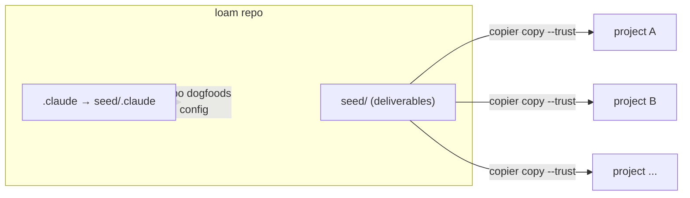
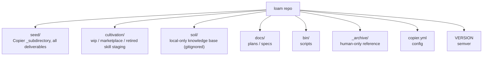
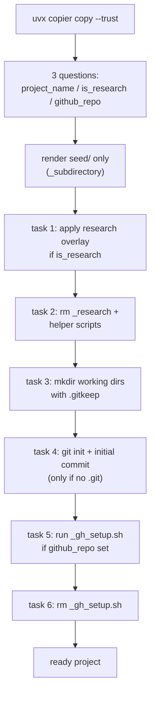
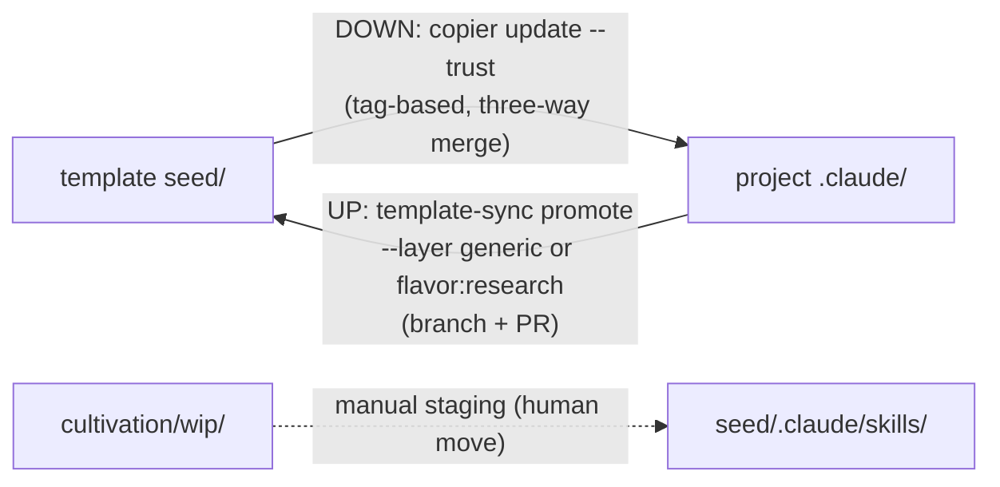
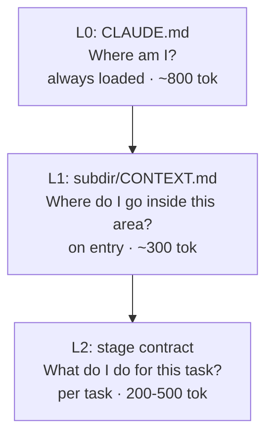
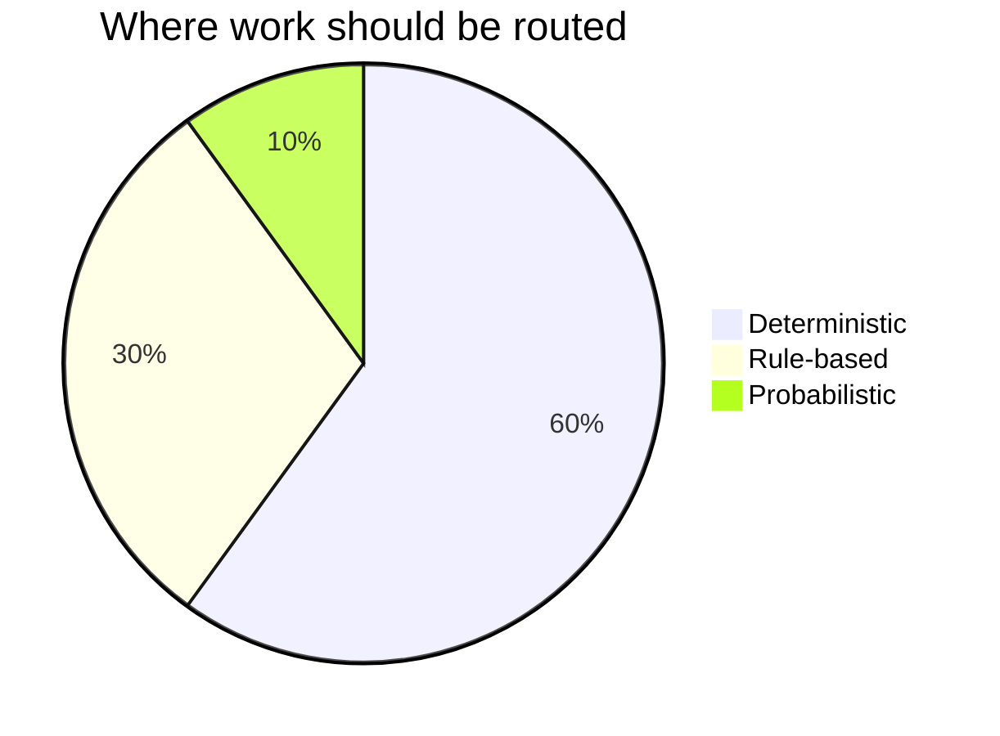
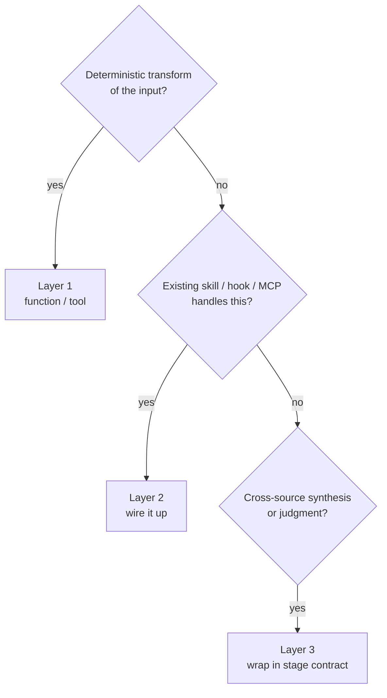
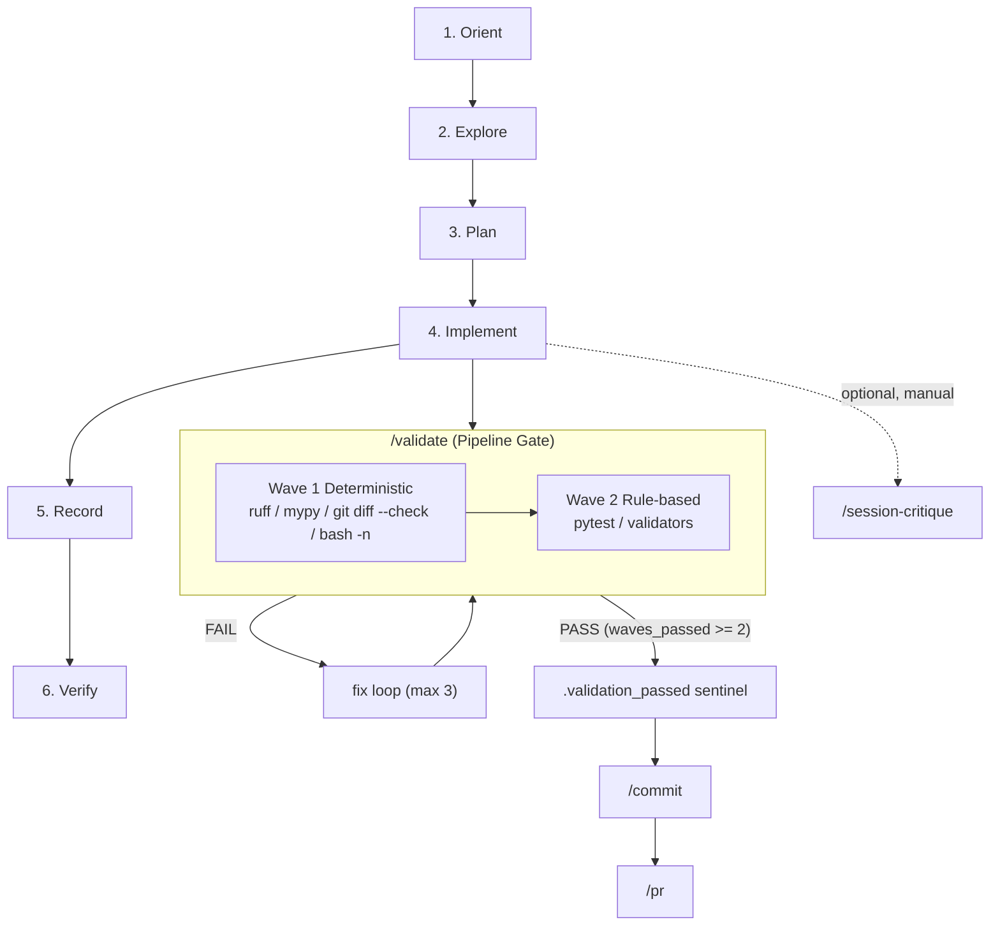

# Visual Overview

Loam is both a Copier template and a Claude Code project: the assets it ships to new
projects are the same assets it runs on itself. This document is a guided tour of the
repo through seven Mermaid diagrams — its dual identity, its layout, the bootstrap and
sync lifecycles, the L0/L1/L2 context-routing model, the 60/30/10 layer triage, and the
session workflow with its Pipeline Gate.

## 1. What is Loam? (dual identity)

Loam ships `seed/` to new projects via Copier, and a `.claude` symlink points back at
`seed/.claude` so the repo runs on the very config it distributes (it dogfoods itself).

_Source:_ `CLAUDE.md:3` (dual-identity statement); `.claude` symlink target confirmed via `ls -l` (`.claude -> seed/.claude`).

## 2. Repository map

The top-level entries and their one-line purposes, distilled from the Layout table.

_Source:_ `CLAUDE.md:22-39` (Layout table).

## 3. Bootstrap lifecycle

Running `uvx copier copy --trust` asks three questions, renders `seed/` only, then runs
post-generation `_tasks` in order to leave a ready project. `--trust` is required.

_Source:_ `copier.yml:21-37` (questions), `copier.yml:38-65` (task order); `docs/BOOTSTRAP.md:32-50`; `seed/.claude/rules/known-issues.md` (`--trust` gotcha).

## 4. Bidirectional sync + cultivation

Two distinct mechanisms move assets, plus a manual staging step. DOWN pulls template
updates via Copier; UP promotes a project asset back as a branch + PR (never to `main`).

_Source:_ `docs/SYNC.md:5-49` (both flows, PR-based promotion, tag-based update); `CLAUDE.md:31` (cultivation staging).

## 5. Context routing (L0/L1/L2)

Three stacked routing layers, each answering one question with its own load timing and
token budget — a map (L0), area routing (L1), and a per-task contract (L2).

_Source:_ `seed/.claude/rules/L0-budget.md` (L0/L1/L2 table — questions, timing, budgets); `context-md-anatomy.md` (L1); `stage-contract.md` (L2).

## 6. 60/30/10 layer triage

Most work should route to deterministic tools or rule-based systems; only a small slice
needs the probabilistic reasoning of an LLM. The decision tree picks the layer.

_Source:_ `seed/.claude/rules/layer-triage.md` (60/30/10 numbers; three-question routing).

## 7. Session workflow + Pipeline Gate

The 6-stage session workflow ends at Verify, where `/validate` runs as a three-wave
Pipeline Gate. Only after all three waves pass is the commit unblocked.

_Source:_ `seed/.claude/rules/workflow.md` (6 stages, ordering); `validation-loop.md` (wave contents, fix loop max 3, `waves_passed` field); `seed/.claude/hooks/pre-commit-gate.sh:82-88` (`waves_passed >= 2` gate). Deep adversarial review (`/session-critique`) is manual and not part of the gate.
