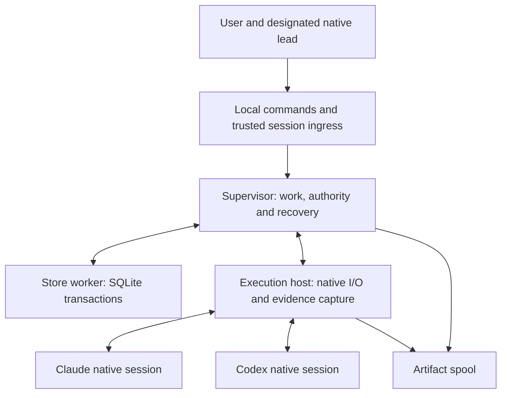

# Engine runtime and module layout

Status: accepted TypeScript language direction for the first complete slice. The user explicitly selected TypeScript after the SWOT discussion and welcomes learning it through the work. Runtime implementation remains deferred. Exact runtime/dependency pins require the named compatibility and failure probes. Project research languages and methods remain independent of this tooling choice.

Critical point: every generated project must run its own factory from documented prerequisites, with one operational authority and no dependency on Loam's development checkout.

Decision status: TypeScript is settled following [the SWOT and independent challenge](language-choice-swot.md). The Python comparison remains useful history. Remaining probes establish a reliable TypeScript implementation; they are not a parallel language-selection exercise. No token, cost or throughput advantage has been measured.

Current mechanism specification: [first run, ownership, storage and recovery](first-run-ownership-storage-recovery.md). It refines this overview with explicit setup/restore transactions, independent bootstrap authority, registered existing-only storage, supervisor-held lifetime ownership, protected host control-session replacement and replayable native/check capture. The [maintenance and remote extension](maintenance-and-remote-work.md) adds Mac-led Linux native/GPU execution through the same execution contract. The project store remains local; a remote runner records execution facts only. These new mechanisms remain recommendations subject to probes. [Current validation](first-run-validation.md) records the resumed main check and source evidence.

## Recommendation and the reason for it

Accepted direction: implement the reusable factory in TypeScript, compile it to JavaScript during Loam's release build, and run it on a pinned supported Node LTS release. Keep its package and dependencies inside the managed factory boundary. Use the accepted Claude TypeScript SDK bridge and narrow direct Codex app-server client. Neither is an outer model/reasoning framework.

Picture a new project starting a research task. Its local factory records the request, prepares a worker brief and connects the chosen native lead. As the agent works, the factory captures observations and keeps pending questions visible. Checks and memory use the same durable record. A single implementation language keeps the core and adapters on shared contract definitions. Both an all-TypeScript engine and a direct-Python engine can achieve this. The user selected TypeScript. Capability, installation and recovery checks now apply to that implementation, and explanations should help the user learn to inspect its behavior.

This does not make the research project a TypeScript application. Its code, notebooks, methods and tools can use the languages appropriate to that project. The factory's dependencies do not go in the project's root package file or research environment.

| Option | Strength | Material cost | Recommendation |
|---|---|---|---|
| TypeScript/Node factory | Direct preferred Claude SDK connection; shared types/validators across core and native adapters; one factory application runtime | Node/SQLite compatibility and process ownership need validation; compiled output and dependency installation need an explicit release contract | Selected |
| Python supervisor with TypeScript Claude bridge | Python standard-library SQLite and process tooling; a credible separation of control and native bridge | Requires Python and Node plus a cross-language message contract, dependency sets and crash/version compatibility handling | Considered; not selected |
| Python factory with Python Claude SDK | One application language; substantial native SDK controls; standard SQLite and Unix locking facilities | Verify precise required control/observation equivalence and supported-host packaging; no automatic research-environment sharing | Considered; not selected |
| Continue expanding the Bash controller | Reuses current command structure | Durable transactions, typed long-lived messages, concurrent native streams and recovery remain awkward responsibilities for shell/prose parsing | Retain useful behavior and fixtures; replace the central control implementation |

Verified: current Loam's controller is Bash, with small Python tooling and a JavaScript native Workflow script. It is not an existing durable Python engine. `copier.yml` renders only seed and conditionally supplies a project Python configuration. Current diagnostics list both Python and Node, but listing tools is not a portable installation contract. During the original layout discussion, `bin/check` was read but not run. On resumption it ran using the existing check environment and reported `check: PASSED`; no dependency installation was needed. That check does not test the proposed engine.

## Runtime and storage baseline

Verified: Node's current release page lists Node 24 as LTS and Node 26 as Current, and recommends LTS for production. The Node 24 SQLite source documentation marks `node:sqlite` Release Candidate since 24.15.0. `DatabaseSync` operations are synchronous. Sources: [release policy](https://nodejs.org/en/about/previous-releases), [Node 24 SQLite documentation source](https://raw.githubusercontent.com/nodejs/node/v24.x/doc/api/sqlite.md).

Recommendation: target the supported Node LTS line, select an exact validated patch at implementation, and record the actual bundled SQLite version and dependency identities. The locally observed Node v26.7.0 and Python 3.14.7 are environment facts from version commands, not recipient requirements. Do not infer that every Node 24 patch has the required SQLite API/fixes.

Use `node:sqlite` as the first storage candidate behind a narrow store interface. It avoids adding a separate SQLite package when sufficient, but Release Candidate status is a real compatibility qualification. Preserve the accepted short explicit transactions and artifact-first publication protocol. Start with the previously proposed rollback-journal settings, subject to durability probes; WAL is not a default requirement. If the bundled binding fails a needed behavior, assess an alternative binding before rewriting the engine. [better-sqlite3](https://github.com/WiseLibs/better-sqlite3) is a credible alternative whose native binary/build coverage needs its own audit.

A dedicated store worker owns the SQLite connection and authoritative transaction functions. This means a background thread running the same Node application, not another state service. Native stream readers must not wait for a SQLite busy timeout or a human answer on their only event-reading path. Store failure blocks new dispatch/acceptance and initiates reconciliation; it does not switch to a second writer or an in-memory authority.

Runtime types do not validate external data by themselves. Keep runtime schema checks at command, artifact, native-event and project-extension boundaries. Preserve integer identities/counters without JavaScript rounding, and serialize their wire form explicitly. Bind exact payload/source identities using the accepted artifact contract.

## Concrete module responsibilities

Recommendation: separate responsibilities by what can change and who may authorize it. Modules are not independent autonomous agents.

| Proposed module | Owns | Boundary |
|---|---|---|
| `commands/` | Setup/readiness, user/session ingress, status and typed requests | No direct state-file edits; ordinary status does not install or launch providers |
| `contracts/` | Work, evidence, memory, context, native observations and decision schemas | Versioned runtime validation; no provider-specific authority defaults |
| `supervisor/` | Admission, obligations, stage progression, accounting, steering and eligible lead decisions | Calls transactional store operations; never replaces lead judgment with an evaluator score |
| `store/` | SQLite worker, transactions, instance/schema identities, migrations and backup coordination | Sole authoritative lifecycle writer; explicit setup creates a store, recovery does not |
| `artifacts/` | Protected capture, content identities, source spans, retention and recovery manifests | File publication and database commit remain distinct durability boundaries |
| `execution/` | Native host lifecycle, local/SSH transport, remote dispatch ledger, workspace ownership, process observations, event spool and pending native requests | One execution contract; remote facts confer no project acceptance authority; no silent retry or completion from exit alone |
| `adapters/claude/` | Official TypeScript SDK streaming input/output and supported controls | Keep native capabilities; separate actual input-generator failure from user cancellation |
| `adapters/codex/` | Direct app-server protocol, events, questions and supported controls | Preserve raw native data; no invented exactly-once guarantee from correlation IDs |
| `checks/` | Protected check execution and complete current result validation | Candidate code cannot write policy or acceptance receipts |
| `memory/` | Proposal/assessment routing, source eligibility, corrections and context packets | Native model reasoning assesses meaning; module cannot promote a remembered claim into authority |
| `improvement/` | Fixed comparison plans, results, lead-decision references and activation requests | Actual session lead Astra/Fable decides; store transaction validates the decision and current inputs |
| `platform/` | Supported-host locking, IPC, filesystem durability and process-control mechanisms | Host-specific mechanisms are validated explicitly; language/process separation is not a sandbox |

Generic methods, role guidance and schemas accompany the engine as assets. Shared entry skills remain in `seed/.agents/skills/`. Their native projections reference one canonical directive home. Native hosts retain reasoning, tools and delegation; the module layout adds no competing model loop.

## Process layout and recovery



Recommendation: isolate each active native connection in an owned execution host process from the same built factory package. A host retains stream capture and correlation and speaks the common command/event protocol. It does not decide acceptance, activate memory, independently retry model work or change the model/effort profile. The store worker remains inside the supervisor application. Process boundaries improve failure handling; actual access isolation still requires the established native/evaluation sandbox contract.

A host that must outlive a supervisor connection needs authenticated reconnectable communication, durable instance/attempt identities and a recoverable event spool. Local hosts use local IPC; the [remote contract](remote-execution-contract.md) adds SSH to a persistent Linux runner. An anonymous pipe or detached process alone does not provide reconnection. On supervisor connection loss, the host admits no new supervisor-directed work or positive approval replies. Existing execution follows its admitted control-loss policy. The accepted mixed default requests native interruption while fixed bounded GPU jobs may continue within their agreed limits. Retain observed events/descendants for reconciliation. Interruption is not proof that all descendants or remote effects stopped. The host remains an observer/control adapter, not a replacement scheduler.

Incoming events must be captured continuously with bounded queues and explicit backpressure. Disk exhaustion, broken spool writes or malformed/oversized framing invalidate the relevant observation guarantee and block affected new authority; they are not an excuse to drop events and report success. Pending human/lead decisions are queued separately from the reader. A restarted supervisor reconciles the same host/attempt before any conflicting dispatch. Lost or invalidated store ownership stops authorization even when the native host is still running.

Verified: Node documents finite-capacity child pipes, the distinction between process exit and stream close, and that sending a kill signal is not proof of process termination. These support the layout, not a proven descendant-stop contract. [Child-process documentation](https://nodejs.org/api/child_process.html).

## Canonical package and generated-project installation

Proposed source layout; none of these new runtime files has been created:

```text
seed/
  .loam/factory/
    launcher.mjs                 dependency-free recipient entry and snapshot resolver
    package.json                 factory-local package boundary
    package-lock.json            resolved factory dependencies
    tsconfig.json                release/development compilation
    src/                         canonical TypeScript modules
    assets/                      generic methods, roles and schemas
    migrations/                  versioned store migrations
    tests/                       canonical TypeScript fixture source
    dist/                        generated JavaScript, including fixture entrypoints
    release-manifest.json        source/build/dependency identities and compatibility
  .agents/skills/                shared native entry skills
  docs/factory/                  recipient setup, operation and recovery guidance
```

Recommendation: TypeScript source is canonical. Compiled JavaScript is an explicit generated distribution copy with a release-verifiable correspondence, as permitted by `docs/ASSET-LAYERS.md`. Builds use pinned tooling and dependencies, omit machine-specific paths/timestamps from compared artifacts, and fail on stale source/output. Recipients normally execute shipped JavaScript without installing a TypeScript compiler. Runtime stripping of TypeScript is not a substitute for release type checking; Node documents that its stripping does not type-check or honor `tsconfig.json`. [Node TypeScript documentation](https://nodejs.org/api/typescript.html).

Explicit factory setup verifies the chosen Node runtime, binding/SQLite compatibility, native executable versions, declared tools/authentication and package integrity. It installs locked runtime dependencies into an instance-owned runtime area outside candidate-worker write access. Package setup must not amend the project's root package configuration or Python environment. A verified install path is required; the design does not assume copying `node_modules`, an accessible personal cache or a preinstalled Loam checkout.

Recommendation: the shipped `launcher.mjs` uses only Node built-ins. For status or a named fixture group it resolves the registered local instance and its admitted runtime snapshot, validates the selected runtime and manifest, then invokes a fixed allowlisted entrypoint inside that snapshot. It does not import dependency-bearing engine modules from the checkout or resolve project-root packages. Missing or incompatible setup produces a readiness error without installation. Tests run in scratch locations under the admitted fixture contract, not against live project state. Ongoing trusted control uses its protected snapshot entrypoints; a worker-edited checkout launcher cannot replace the running supervisor or its selected modules.

The seed carries both adapters and the full generic infrastructure. Credential readiness is checked for the selected native profile; credentials are never shipped. Factory setup availability and the selected profile's readiness are reported separately. A missing unselected account must not masquerade as a missing factory. The other provider's dependencies/setup remain documented and supplied.

Copier distributes managed source/build/manifests and preserves project-owned configuration/extensions and local state. Before an engine is admitted, copy/verify the exact release payload and resolved dependencies into its protected runtime snapshot. Existing active work uses that snapshot. An update cannot silently mutate the runtime/modules or dependencies of an active invocation. Generated runtime installations, caches, databases and run history must be explicitly excluded from rendering and source packaging. Tests verify absence; convention alone is insufficient. Native config/profile snapshots retain their separate identity and compatibility checks.

Initial install may require network access for declared dependencies/runtime downloads. Once a complete supported installation is available, fixture execution must not need the original checkout or undocumented caches. An air-gapped installer or cross-platform executable bundle is not being promised in this slice. Do not claim compiler-free installation on a platform that lacks a required native dependency prebuild.

## Material gates before relying on the implementation

Recommendation: prove storage, ownership and recipient packaging in TypeScript before expanding the full supervisor implementation.

- SQLite compatibility: exact Node/SQLite versions, explicit transactions, busy handling, backup/restore, migrations, large integers and crash/artifact boundaries. An existing registered store must never be treated as new setup because a binding can create a missing file. Validate guarded existing-store open and identity checks; do not invent an unsupported open flag.
- Execution ownership: the accepted OS-backed lifetime-lock contract still needs a selected, audited host mechanism. A time-based lockfile/lease is insufficient. Node core access alone does not establish it. The source-inspected [fs-ext project](https://github.com/baudehlo/node-fs-ext) exposes advisory file locking through a native binding, but its current source uses a native build and is not validated for our target Node/platforms. It is a candidate to investigate, not an adopted dependency. If a suitable Node host mechanism cannot be packaged and proven, resolve the binding or an explicit narrow platform helper before dispatch implementation. Any proposal to change the accepted language returns to the user; no automatic substitution is authorized.
- Reconnection and isolation: a supervisor death, surviving native worker, delayed approval and stale host must not duplicate execution or acquire new authority. Validate actual local IPC authentication, lock lifetime and platform process identity. A store thread or child process is not an OS security boundary.
- Installation/build: source/build correspondence, package isolation from project settings, native dependency coverage and no implicit runtime installs from status/check commands. Every promised project kind receives the same complete tooling.

Accepted host update: validate this Mac and `jhaveris` Linux as the required release targets. Both need the complete generated-project proof and native/storage/locking checks. Package installation, upgrades and downgrades to supported stable versions are acceptable. The [two-host setup design](execution-environment-and-bootstrap.md) supersedes the earlier open host matrix. Exact runtime and binding pins remain compatibility candidates until tested on both machines.

## Future runnable checks and existing test integration

The previous Python commands described tentative fixture interfaces before choosing the runtime. With TypeScript accepted, the following Node fixture entrypoints are the proposed interfaces for the new managed engine. Keep Loam's existing Python tests where they provide useful repository/render validation; they do not become a mandatory second engine runtime in generated projects.

| Increment | Future generated-project command | Decisive result |
|---|---|---|
| Actual recipient payload and installation | `node .loam/factory/launcher.mjs verify installation` | Actual rendered payload and registered snapshot match; dependencies resolve only there; denied original checkout/personal assets do not break the fixture |
| Storage and responsiveness | `node .loam/factory/launcher.mjs verify store` | Locked database does not block native event capture; missing store/corrupt reference cannot become successful setup; transaction/crash cases preserve state |
| Host ownership and recovery | `node .loam/factory/launcher.mjs verify execution` | Competing owner denied, supervisor loss preserves unknown in-flight work, raw stream/approval receipt recovery prevents duplicate dispatch |
| Task, memory and lead adoption | `node .loam/factory/launcher.mjs verify complete-slice` | Full accepted proof flow; evaluator recommendation alone cannot activate; exact current lead decision can do so |

These commands and the launcher are proposed, unimplemented and unrun. The launcher maps each group to fixed `dist/tests/*.test.js` entrypoints inside the verified installed snapshot and invokes the validated Node executable with `--test`. Each group asserts its expected nonempty fixture population. Current `node --help` confirms `--test`, but that is not a fixture run or recipient capability proof.

All-project-kind rendering and template-update tests belong to Loam's release verification, because a generated project does not contain root `copier.yml` and the full source template. Proposed Loam-only command: `node --test bin/tests/factory-release-render.test.mjs`. That fixture uses explicitly provisioned build/Copier prerequisites, renders the exact candidate template with isolated local settings, exercises update preservation and launches the recipient's own verification commands after removing access to the original checkout. Its helper is release tooling, not a missing recipient runtime dependency. Recipient fixtures verify the actual supplied project and installation; they do not pretend to recreate every project kind. Source/build correspondence is checked during the same release process before rendering.

## Evidence, alternatives and next step

Independent source readers assessed Python/TypeScript and Node/storage. Both preferred TypeScript conditionally on the material storage/host gates. Python's [sqlite3](https://docs.python.org/3/library/sqlite3.html) and [async subprocess](https://docs.python.org/3/library/asyncio-subprocess.html) interfaces remain credible alternatives; their documented capabilities do not remove native lifecycle and authority obligations.

An initial repository search named a nonexistent `bin/verify-template.sh` and returned an error. A corrected inventory located `bin/tests/test_render_smoke.py`; subsequent inspection used existing files. The Node SQLite HTML endpoint failed in the web tool; its official version-branch source supplied the actual API/status evidence. No failed retrieval is treated as feature absence or a passed check.

Assumptions still requiring implementation evidence: selected native locking mechanism and platform packaging, actual runtime/SQLite patch behavior, SDK queue/control behavior, protected execution and reproducible builds. These are not reasons to add another agent framework or weaken the factory contract. No dependencies, runtime code, model jobs, automations or commits were created.

Next: the [concrete mechanism specification](first-run-ownership-storage-recovery.md) is now written and independently reviewed. Sequence its file-level implementation tickets and close the native configuration/actual-lead binding specification. Runtime implementation and capability probes still wait for explicit authorization.

## Independent critique

A fresh-context review identified that direct checkout test paths could not resolve dependencies installed only in protected snapshots, and that recipient tests could not recreate Loam's full render matrix without root template configuration. The proposed dependency-free snapshot launcher and separate Loam release rendering fixture repair those design gaps. These are specification changes, not executed tests. Native ownership and runtime compatibility remain open prototype gates.

Verified: the bounded independent rereview confirmed both repairs and found no remaining concrete correctness gaps in that launcher/package/acceptance scope. A documentation validation command reported `Runtime design document checks: PASSED` for current local links, preserved snapshot hashes, required design boundaries, whitespace and documentation-only Git scope. No runtime tests ran.

Self-attack: an absent store, stale runtime snapshot or dependency unavailable on a target host can break the proposed installation. Those cases remain explicit future acceptance obligations. Native approval, restart and provider capability paths have source evidence but no execution evidence in this design step. The changes are prose only; no runnable engine behavior is claimed. Language selection is accepted. Host locking, SQLite compatibility and dependency packaging remain unresolved until their probes run.
