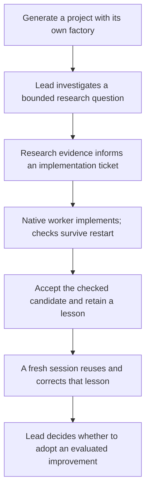

# The smallest complete generated-project slice

Host-scope update: the complete proof must pass on this Mac and `jhaveris` Linux, using the same released factory source and recorded host-native dependencies. Linux is a required target now. Preserve the separate native-provider proof obligations; a successful Mac run does not qualify Linux. See [two-host setup](execution-environment-and-bootstrap.md).

Remote-work addition: the user also requires a Mac native session to launch and monitor Linux native agents and GPU experiments. Extend the proof with an admitted remote worker and bounded GPU job, a lost launch reply/SSH disconnect, recovery of the original job and logs, pending offline cancellation and current local acceptance. Exercise runner restart, reboot and old-controller fencing as failure cases. Both native providers need actual binding evidence; a fake adapter or successful GPU exit does not prove research judgment. Mac/Linux replacement machines require enrollment and readiness rather than inherited identity from an SSH alias. See [remote execution](remote-execution-contract.md) and [ordered tickets](maintenance-remote-tickets.md). This fixture does not require every research task to use a GPU. Runtime implementation remains deferred.

Status: accepted direction for the first implementation milestone. Runtime work remains deferred. TypeScript is accepted. The Node commands below are proposed and unimplemented. [Runtime and layout](engine-runtime-and-layout.md) and [first-run mechanics](first-run-ownership-storage-recovery.md) separate Loam release rendering from recipient verification. The user has specified that improvement-adoption decisions belong to the session lead Astra or Fable. This milestone is an early proof of the core architecture, not permission to ship an incomplete factory as the finished product.

## Follow one project through the system

Illustrative fixture: generate a small research project with supplied reference documents and a research note. Ask whether those sources justify pursuing an approach. The source material contains both support and a limitation. The project also needs a small command that detects missing or changed references in its note. These are test materials, not new compulsory product features or a research-domain restriction.

The lead investigates the question and asks an independent researcher to challenge the interpretation. It records a supported, refuted, mixed or inconclusive conclusion as appropriate to the evidence. Then it defines the small implementation ticket for reference checking. Mechanical reference integrity does not establish that a source supports a scientific claim; the research review and the command check have distinct jobs.

The native implementation worker produces the command and its checks. We deliberately interrupt the supervisor during checking. On restart, it reconciles the original execution, resumes the incomplete checking stage and preserves the actual candidate. It does not launch another implementation worker just because it lost its connection.

After complete current checks and required independent review, the project records acceptance. It captures a scoped lesson with the source evidence. In a fresh session, that lesson helps the lead handle a related task. We then correct the lesson and verify that the next handoff reflects the correction. A delayed summary based on the old wording cannot restore it as current advice.

Finally, an evaluated improvement candidate is presented to the session lead. A favorable evaluator result alone leaves it pending. The lead can decline it, ask for more evidence or adopt it within existing authority. Loam records and validates that decision. This final check establishes the boundary between assessment and the lead's judgment.

This is a chosen proof scenario. Ordinary research can finish without an implementation ticket or a proposed workflow improvement. The example connects those paths to demonstrate their integration, not to require them after every inquiry.

## What we implement together first

Recommendation: build the core services as one end-to-end path rather than finish a large memory subsystem or every native coordination feature in isolation.

| Increment | Existing responsibility | Required change and dependency | Future runnable acceptance check |
|---|---|---|---|
| Portable factory and local setup | Copier renders seed; root factory code does not render | Place canonical core runtime, both adapter interfaces, generic method/role contracts, setup and fixtures in seed; declare runtime prerequisites for every project kind | Loam release: `node --test bin/tests/factory-release-render.test.mjs`; recipient: `node .loam/factory/launcher.mjs verify installation`. Release tooling renders the exact candidate across project kinds; each recipient verifies its own installed payload without the original checkout/personal assets. Setup and missing-store behavior also use `verify store`. |
| Durable work and evidence | Frozen ticket/check files and current grader concepts | Add protected artifacts, SQLite identities/transactions, method obligations, lead/worker binding, action inventory and exclusive ownership | `node .loam/factory/launcher.mjs verify store`: inquiry/decision/ticket references persist; missing required evidence and unauthorized records cannot advance work |
| Native execution and honest completion | Current direct worker calls, checks and graders | Connect adapters to the same work/observation contract; isolate evaluation and preserve findings; distinguish failure, error and unsupported execution | `node .loam/factory/launcher.mjs verify complete-slice`: an actual failed required case and malformed review block acceptance; passing current complete evidence permits it |
| Restart and steering | Current filename-based resume | Use durable action/attempt records and native reconciliation; scope corrections to affected work | `node .loam/factory/launcher.mjs verify execution`: crash during checking does not duplicate implementation; a surviving writer blocks conflicting work; late old evidence cannot accept revised work |
| Shared memory and a later session | Catchup/handoffs and source guidance | Capture/assess one lesson, construct current context, observe delivery and invalidate corrected dependencies | `node .loam/factory/launcher.mjs verify complete-slice`: fresh-session retrieval has original evidence; source pointer does not claim inspection; correction and delayed consolidation preserve the current interpretation |
| Evaluated improvement and lead decision | Existing grader evaluation, no complete adoption contract | Bind fixed comparison evidence and candidate to a designated lead/session decision; supervisor validates activation/rollback | `node .loam/factory/launcher.mjs verify complete-slice`: evaluator PASS without a lead decision stays pending; worker-spoofed lead and stale decision are rejected; current authorized lead decision can activate; refusal keeps the prior revision |

The commands name proposed future fixtures, not tests that exist or were run. Canonical TypeScript fixtures are in the proposed `seed/.loam/factory/tests` package; compiled fixture entrypoints ship in `dist/tests/`. The recipient launcher resolves fixed fixture groups inside its admitted installed runtime and checks its declared nonempty case population. Loam release tooling owns the full render/update matrix. Recipient fixtures verify the actual supplied project and scratch installation, never mutate live state or reinstall implicitly.

Pair the distribution proof with an update case: managed source can update while project configuration, accepted decisions and local state remain preserved. An active run retains a compatible admitted engine/input snapshot or the update reports a blocker. The seed must never copy project history or depend on the original checkout after rendering.

## Mechanical proof, native proof and actual use

Recommendation: first drive the complete path with a deterministic fake native adapter. It provides explicit events and artifacts so crashes, missing results, corrections and stale lead decisions can be reproduced. A fake decision verifies the authority-handling code only; it does not count as a real lead judgment, independent reasoning or a demonstrated research result.

Then run the same bounded task through each real native adapter, separately, under the user's allowed driver/model/effort profile. The designated Astra or Fable lead makes actual decisions in those sessions. The native proof must establish relevant configuration, authentic input/role binding, supported observation and continuation behavior. A green fake fixture cannot waive missing native capabilities.

Next use the installed factory on real project tasks and record useful/harmful memory effects, corrections and concrete failures. Expand controlled cases from that experience. Do not infer a general quality improvement from a successful demonstration or require a favored scientific answer to pass the research portion.

Both providers must satisfy the common contract before this milestone is described as proving cross-provider execution. A fresh session on the other provider should recover shared evidence without the first provider's private memory. Any native behavior not established remains explicitly unsupported or pending; do not silently fall back after uncertain execution.

## What this milestone establishes and what remains

Recommendation: the milestone establishes a portable connected core: idea to evidence/decision/ticket, checked implementation with recovery, usable corrected memory, and lead-owned improvement adoption. Domain-specific tools, richer retrieval, every advanced native team/goal/advisor surface and empirical research quality need their own later validation. Their required distributed contracts and setup remain part of the full factory design. This staging does not make the factory optional in any seed or lower the eventual release requirements.

No recurring automation is activated as part of a claimed read-only check. No publication follows merely from acceptance. No runtime implementation is authorized by this document.

## Grounding and next decision

Verified: `copier.yml` sets `_subdirectory: seed`, and the saved [current-code map](prior-design/cookbook-current-code-map.md) identifies root-only factory assets, personal skill lookup, direct worker invocation, text-based check outcomes and filename resume. The proposed slice exercises the replacements that matter together. The [cookbook integration design](prior-design/cookbook-integration-design.md) and [memory contract](memory-records-and-delivery.md) provide the source-grounded method, artifact and native boundaries; this document does not add a new orchestration runtime.

Next: TypeScript and the module/package direction have been selected. Use [the concrete first-run specification](first-run-ownership-storage-recovery.md) and [the next-session handoff](START-NEXT-SESSION.md) to sequence file-level implementation tickets and remaining native-binding design. Coding still waits for explicit authorization.

## Design review and limits

Verified: a fresh-context reviewer checked lead ownership, native/fake proof boundaries, broad research scope and continuity against the linked contracts and reported no concrete gap within that scope. No runtime test, native execution or research experiment was performed.

Self-attack: a worker can claim to be the lead, a fake PASS can be mistaken for native proof, or this connected example can be misread as requiring implementation after every inquiry. The design explicitly binds actual lead identity, requires separate native evidence and permits inquiry-only outcomes. Actual isolation, configuration/role binding and empirical usefulness remain unverified. Only design documentation changes are authorized here.
