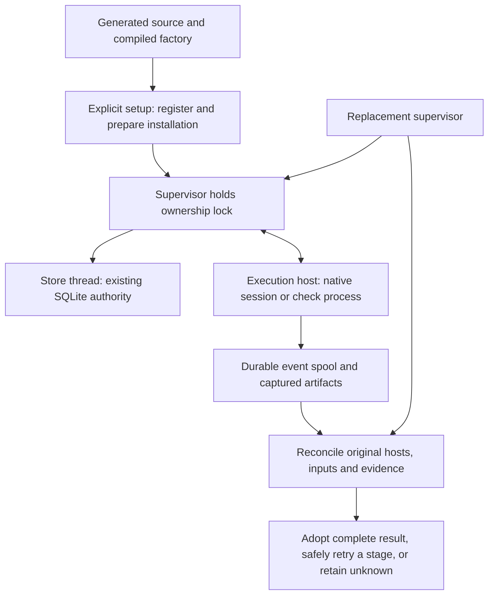

# First run, ownership, storage and recovery

Status: the user accepted the first-run/ownership/storage/recovery direction with "looks good" and asked to proceed. Exact dependency pins, host mechanisms and compatibility claims remain subject to the stated probes. This acceptance does not authorize runtime implementation. This document refines [runtime and layout](engine-runtime-and-layout.md); the accepted work, steering, memory and lead-decision contracts remain governing. The next proposal is [native profiles and actual lead binding](native-profile-and-lead-binding.md).

Critical point: a replacement supervisor must recover the existing authority and surviving work without granting duplicate execution.

## Follow the generated project

Illustrative story, not an executed fixture: you generate a research project. Its factory source, compiled program, both adapters, methods and setup guide arrive together. Explicit setup prepares a private local installation and an empty registered store. Selecting Codex or Claude then checks that provider's account and required capabilities separately.

You ask whether supplied sources justify pursuing an approach. The native lead investigates with independent critique, records the conclusion and prepares the justified reference-checking ticket from the accepted proving slice. The implementation produces a candidate. A protected execution host runs its checks and captures their output.

The supervisor dies after a check result becomes durable but before the database receives it. The host preserves the output and requests interruption of still-running work under the admitted control-loss policy. On restart, a new supervisor obtains exclusive ownership, opens the existing database, reconnects to the original host and inspects its evidence. Complete matching evidence can be adopted once. Partial evidence remains an error or unknown outcome. Neither case calls for another implementation worker automatically.

Recommendation: make the ordinary experience setup, start authorized work, inspect status, and recover. The mechanics below explain how these actions retain their meaning through failure. Command names are proposed interfaces, not installed commands.

## Candidate choices and their tradeoffs

| Mechanism | Recommended first candidate | Alternative and reason to defer |
|---|---|---|
| Runtime | Exact supported Node LTS patch with compiled TypeScript and a factory-local dependency lock | Floating system Node cannot establish reproducible compatibility; research dependencies do not own the factory runtime |
| SQLite | Built-in `node:sqlite` behind a narrow store interface; factory-generated `file:` URI with fixed `mode=rw` for an existing store | `better-sqlite3` with its documented existing-file option if the bundled binding fails a required probe; native package compatibility must then be proved |
| Lifetime ownership | macOS local-disk probe using a narrow wrapper around `fs-ext` nonblocking exclusive `flock` | A narrowly scoped native helper if the binding cannot meet packaging/lifetime requirements; an expiring lockfile is not an equivalent alternative |
| Host connection | Authenticated Unix-domain socket for local hosts; SSH to an enrolled Linux runner for remote work, with a durable spool and explicit control-session replacement | Anonymous pipes alone cannot reconnect; remote execution facts do not acquire project authority |
| Installation | Independently prepared immutable runtime snapshots outside candidate access | Running directly from a worker-writable checkout permits active engine mutation; a fully bundled executable remains a later packaging option |

Accepted host update: this Mac and `jhaveris` Linux are the required targets for the first complete proof. The earlier Mac-first sequencing does not defer Linux support. Qualify the same storage/locking/ownership behavior on each actual host, with narrow platform implementations where needed. Package changes are acceptable to the user. See the [two-host setup design](execution-environment-and-bootstrap.md).

Verified: the independent reader inspected Node release source at `v24.21.0`; the lead reopened that source. It enables SQLite URI handling while ordinary writable open also permits creation. SQLite documents `mode=rw` separately from create-capable `mode=rwc`. Likely: a controlled URI supplies the needed existing-only open. The exact runtime fixture has not run. [Pinned Node source](https://raw.githubusercontent.com/nodejs/node/v24.21.0/src/node_sqlite.cc), [SQLite URI contract](https://www.sqlite.org/uri.html).

Verified: Apple documents advisory `flock` locks and descriptor inheritance. The inspected `fs-ext` manifest runs a native build. The binding is a proposed dependency, not installed or validated here. [Apple locking contract](https://developer.apple.com/library/archive/documentation/System/Conceptual/ManPages_iPhoneOS/man2/flock.2.html), [binding manifest](https://raw.githubusercontent.com/baudehlo/node-fs-ext/master/package.json).

## The physical homes and their owners

All new filenames below are proposed. No live registration, store or runtime is created by this document.

| Home | Contents | Ownership |
|---|---|---|
| Project `.loam/factory/` | Canonical TS, compiled JS, locked dependencies' metadata, generic assets, migrations, fixtures and release manifest | Loam-managed source, updated through Copier; edits are a visible local fork |
| Project `.loam/project.toml` and declared extensions | Project choices, domain methods and references to authored decisions | Project-owned; installation/update never silently replaces them |
| Git common directory `loam-instance.json` | Nonsecret instance lookup hint | Not authority. Workers may have Git write access. A changed hint cannot redirect trusted control |
| Operator-selected local control root | Protected `registry/`, `instances/`, `runtimes/` and short `ipc/` paths | Created/documented at setup, outside candidate roots and shared/network filesystems |
| `registry/` | Common-directory binding, random instance identity, setup transaction, runtime selection and recovery status | Trusted installer/supervisor; consulted even if the Git hint disappears |
| `instances/<instance>/` | Stable `owner.lock`, replaceable owner rendezvous record, `state.sqlite`, `artifacts/`, `hosts/`, backup manifests | Supervisor authority; hosts write only their admitted spool/capture locations |
| `runtimes/<snapshot>/` | Complete installed release, resolved runtime dependencies, validated Node executable identity and fixed entrypoints | Immutable after verification; active work retains its snapshot |

Recommendation: require the operator to select or accept a documented local control root once. Do not discover a personal Loam development checkout or assume an undocumented cache. A protected operator control entrypoint remembers this binding. A checkout launcher is a convenience client, not the trust root for an already-running factory.

Bootstrap authority is explicit: the operator admits an exact release payload identity or a reviewed local-fork identity through setup code acquired independently of candidate-writable source. The initial trusted source can be an operator-reviewed clean release checkout obtained through the authenticated release channel; it cannot be an unexamined candidate checkout vouching for its own manifest. Record that admission and the expected payload digest in the protected registry. The protected control wrapper and sandbox policy come from that admitted payload. Existing installations use the protected wrapper and independently admitted update identity. A self-consistent change to checkout launcher, program and manifest remains an unadmitted fork. Exact release-authentication and bootstrap distribution tooling belongs in the packaging ticket; integrity hashes alone do not authenticate authorship.

Resolve the actual Git common directory using trusted Git invocation with repository-redirection environment overrides excluded, then canonicalize and bind its filesystem identity. Linked worktrees share that identity. A separate clone needs explicit new-instance setup. A move, copied registration, different filesystem object at the same path or conflicting hint requires relocation/recovery. Neither remote URL nor project name proves identity. Verified: Git documents both the common-directory query and environment overrides. [Git path queries](https://git-scm.com/docs/git-rev-parse).

Recommendation: directory placement and owner-only permissions are hygiene, not same-user isolation. Before native or candidate check execution, the admitted sandbox must deny access to control credentials, sockets, registry, lock, authority store and protected runtime, including aliases and symlinks. Workers receive declared workspace/staging access and scoped evidence copies. The trusted host owns the provider connection and never passes host/control secrets into worker arguments, environment, prompts or output. If enforcement is unavailable, the managed profile remains unsupported; do not describe a cooperative convention as protected execution.

## Setup as a recoverable operation

Recommendation: make installation preparation, instance creation and provider readiness distinct results. A valid full factory can exist while the selected account needs setup. An unavailable unselected account does not erase factory availability.

1. Inspect the generated payload, project configuration, Git identity and registry. Existing adoption with missing configuration/store is a recovery case. Pre-factory projects use a reviewed first-adoption path that preserves any pre-existing `.loam` content.
2. Under a stable registry setup lock, reserve the instance identity and persist a pending setup transaction before creating state. Concurrent setup for the same common directory reuses or reports that transaction. An existing registered identity cannot be replaced by a new one through the ordinary setup command.
3. Prepare a new runtime in an isolated staging directory. Verify the release payload, pinned toolchain, lock consistency, declared dependency origins and installation procedure. Dependency build scripts execute only through the reviewed installation plan, without access to existing control credentials or live instances. The `fs-ext` candidate means native build tools or a validated prebuild must be explicitly supplied; compiler-free setup is not yet promised.
4. Verify the installed dependency closure, compiled payload and entrypoints, then publish the immutable runtime snapshot. A partial install never becomes the selected runtime. Record installed file identities separately from the release source/build manifest.
5. Create the stable instance directory and ownership-lock file for this pending setup only. Acquire that lock, initialize the store through the dedicated creation entrypoint, write its instance/schema identity, and verify its empty operational state. Publish the ready registration last. The Git hint can be repaired from that registration.
6. Report factory availability, selected provider readiness and missing capability proofs separately. Setup does not admit research, start native workers, schedule work or authorize publication.

An interruption leaves a named pending setup. Resume verifies its existing files and identities before finishing the same transaction; it does not delete and start over. A failed install with no store can prepare another runtime snapshot under that pending transaction. A corrupt/mismatched partial store requires diagnosis, not automatic overwrite. Lost registry plus surviving files is an explicit recovery/import case. Total loss of all evidence cannot be detected magically; new setup must never be advertised as restoration of the prior history.

Verified: `npm ci` requires lock consistency and replaces an existing installation directory; disabling scripts suppresses package scripts but does not prove a native dependency works. Recommendation: use a fresh factory staging directory, controlled npm configuration and an explicit script/build allowlist. Never run installation against an active snapshot or the project root. [npm clean-install contract](https://docs.npmjs.com/cli/v11/commands/npm-ci/).

Recommendation: sanitize engine launch inputs before Node starts. A JavaScript launcher cannot undo code preloaded before it executes. The trusted setup/control wrapper selects the admitted Node executable and excludes unapproved preload, module-search, loader and package-manager environment inputs. Preserve native authentication through the separately admitted provider environment. Verified: Node documents preloaded modules through `NODE_OPTIONS` and extra CommonJS search roots through `NODE_PATH`. Those mechanisms motivate this boundary; they do not validate the wrapper. [Node CLI](https://nodejs.org/api/cli.html), [Node module resolution](https://nodejs.org/api/modules.html).

## Starting and retaining the sole owner

Recommendation: the supervisor process holds the instance lifetime lock; its dedicated store thread owns the SQLite connection and transactional command handlers. The lock and connection belong to the same process lifetime, but a storage-thread failure must not release ownership while the supervisor is still reconciling. This refines the earlier suggestion to put both resources in the storage thread.

Acquire nonblocking exclusive ownership on the existing lock file before opening the registered store. Never unlink, truncate-and-replace or rotate that file to clear stale ownership. Verify the path still identifies the locked object. The lock descriptor is not inherited by execution hosts. A heartbeat or PID is diagnostic only; a stalled owner remains owner until its actual lifetime ends or it completes an orderly handoff.

Open the registered store through a separate existing-only entrypoint. Build the encoded local file URI internally with fixed `mode=rw`; no arbitrary URI, in-memory store, remote authority or create fallback is accepted. Reject missing, empty, corrupt, foreign or incompatible stores before application mutation. Under ownership, check instance identity and schema compatibility before recording a fresh random owner incarnation. That identity cannot repeat merely because a database was restored.

The store thread accepts typed domain commands, never arbitrary SQL from workers. Each transaction validates current owner, actor scope, work/attempt revision, barriers and required evidence, then commits state, event and settlements together. Begin with the prior rollback-journal/`synchronous=EXTRA` candidate and explicit foreign-key enforcement; read back effective settings. Pin and probe the exact runtime, bundled SQLite, integer representation, backup and error behavior before release. Busy storage must not block the native event reader.

Publish a protected owner rendezvous record only after the ownership transaction commits. It identifies the incarnation, compatible runtime and fresh control capability. It is a discovery/authentication aid; SQLite remains the lifecycle authority. Startup gaps leave the owner unavailable or reconciling, never ready by inference.

If the store thread fails, close new admission and dispatch authorization, retain the process lock and request control-loss handling from hosts. Do not replace the writer in place. Complete orderly shutdown where possible; close/terminate the storage thread before releasing ownership. A full process death releases ownership through the OS. Already authorized actions remain in-flight until reconciled, even if their caller never received a response.

## Host connection, command fencing and event capture

Recommendation: use the same durable execution-host contract for native sessions and candidate checks. A checker attached only to supervisor pipes would lose the very evidence the recovery story depends on.

Each host has a random host identity, original attempt/action binding, its own persistent lifetime lock and a short local socket path under the protected root. Its bootstrap record is durable before native/check dispatch can occur. Duplicate bootstrap requests cannot launch duplicate work: the host lock prevents simultaneous owners, and its durable dispatch ledger prevents replay after a host restart. An ambiguous prior dispatch remains unknown, including a host that died while its native child survived.

Authenticate both endpoints using per-host secret material and fresh connection challenges. Bind authentication to instance, host, original attempt, protocol/runtime compatibility and current owner incarnation. Separately authorize a control session from the protected current-owner record. A host secret proves identity, not current supervision authority. Readiness must establish that only trusted control processes can read/write these credentials and records.

On reconnect, start in observation mode. The host replays durable events and lists pending commands, approvals, native inputs and surviving jobs. After matching current ownership and the reconciliation inventory, replace its control session, invalidate the old session and withdraw old unexecuted queued commands. Record that replacement durably before acknowledging it. Commands carry a session identity, stable command identity, exact payload digest, attempt/revision and authorization reference. Reject old-session commands, conflicting duplicate identities and obsolete positive approvals. Revalidate the protected owner binding at dispatch; a race that already crossed dispatch stays in-flight and prevents conflicting replacement work.

One host process owns its native I/O. It does not independently retry work, choose models, waive obligations or write SQLite acceptance. Its command ledger records receipt and attempted execution, not new authority. Sending an execution-triggering input requires the supervisor's durable dispatch authorization. A duplicated delivery returns its recorded outcome; an unknown send is reconciled, not repeated merely because the transport reconnected.

For each stream, retain host identity, stream identity and monotonically ordered local frame positions. Frames have a bounded length, integrity check and original native bytes. Persist complete frames before claiming durable capture. The supervisor commits its ingestion cursor together with resulting observations/settlements. Replay of the same frame is harmless; different frames with identical native text remain distinct events. Native replay from a new connection retains its replay provenance rather than pretending local positions are native event IDs.

On spool failure, exhaustion or a gap, mark the relevant observation guarantee unavailable and request interruption. Never discard a tail and certify complete evidence. Preserve incomplete frames for diagnosis and process complete validated frames only. Spool retention waits for durable ingestion and the artifact/backup/recovery retention contract. Host directories outside a restored database are evidence of possible surviving work, not garbage to remove.

Connection loss closes new supervisor-directed execution and positive approval replies. The local/native control-loss proposal requests interruption and continues capture. The [remote contract](remote-execution-contract.md) adds the accepted exception for already started fixed GPU jobs within their persisted limits; waiting work cannot start offline. It does not claim every descendant or external action stopped. A host can finish publishing already captured evidence; that cannot accept the task. Socket cleanup needs evidence that its identified host is gone; a pathname or failed connection alone is insufficient.

## Recovery after the supervisor dies during checking

1. Acquire the existing lifetime lock. Validate registration, runtime/store compatibility and database identity. Record a fresh owner incarnation in recovery mode. Do not clear workspace claims or capacity reservations.
2. Build the unfinished-operation inventory from the database and protected host/bootstrap/spool records. Include already delivered approvals, native queued inputs, descendants, checks and external effects. A newer host absent from an old backup is unresolved work.
3. Reconnect observationally to authenticated hosts. Reconcile stream positions, command states and actual process/job identities. A reused PID cannot prove identity or justify a kill. Lost native visibility keeps that operation unknown.
4. Validate the exact candidate, criteria, required population, profile and captured result. Recheck steering/correction barriers and reconcile writers. Publish complete immutable artifacts before committing any adopted result receipt.
5. If a complete check artifact exists without a receipt, adopt it under current validation authority while retaining its original producer/attempt. If its receipt already committed, replay settles nothing twice. If it is partial, record error; a new check attempt requires proven quiescence and an admitted repeat-safe check. Checks that may have external effects require effect reconciliation, not automatic rerun.
6. Resume only the eligible stage. Acceptance still requires current complete checks, independent review, resolved findings and applicable policy evidence. A pause, successor requirement or unsupported profile prevents acceptance regardless of recovered PASS output. A new native invocation receives a new attempt; passive observation keeps the old attempt.

| Crash or conflict | Required visible outcome |
|---|---|
| Registered database missing or empty | Recovery required; no empty replacement, no dispatch |
| Another process holds the lock | Owner busy; no takeover by timeout |
| Store thread fails but supervisor remains | New authority closed; lock retained through shutdown/reconciliation |
| Dispatch committed, native/check handle absent | Possibly in-flight; no blind duplicate |
| Check artifact published, receipt absent | Validate/adopt once, retaining producer identity |
| Receipt committed, ingestion acknowledgment lost | Replay without duplicate receipt or accounting |
| Old result arrives after a requirement change | Preserve history; cannot satisfy the successor's checks |
| Host dies and worker may survive | Quarantine workspace and retain unknown execution |
| Approval was sent before loss but consumption unknown | Reconcile original request/action; no fresh positive answer by default |
| Missing/corrupt referenced artifact | Evidence loss blocks dependent satisfaction and acceptance |

## Updates, backups and restored history

Recommendation: prepare updates as new runtime snapshots. Compare effective project configuration and managed-source forks before selecting one for future admissions. Existing work retains its installed snapshot and admitted inputs. Source/build equality is a release check; the recipient verifies its supplied payload and actual installation. Never ask a generated project to reconstruct Loam's entire template matrix.

A compatible engine update can prepare alongside active work, but the new owner must support all active host/store protocols before takeover. An incompatible schema migration requires quiescence, including hosts and consequential jobs, a verified backup and exclusive ownership. No old runtime may reopen a migrated incompatible store. Do not swap database files while any writer/reader still relies on their identity.

For the first implementation, prefer an explicit quiescent backup procedure: close the database connection under retained lifetime ownership, freeze host/spool mutation, preserve the database and complete referenced immutable artifacts plus registration/host inventory in a verified manifest. Publish backup completion only after the copies and manifest are durable. Normal work resumes after reopening and validation under the same owner. An online backup path can be added only with an equivalent tested consistency contract.

Restore is an explicit operation, never startup error handling. Preserve current records and compare the selected backup with protected host inventory and external effects before replacing anything. Hold registry/instance ownership through restoration and validate a new store-history identity plus fresh owner incarnation. Old control capabilities are not restored. Reconcile everything that could have happened after the backup, including corrections/retractions, publication, model jobs and old lead decisions. Imported evidence starts without live execution authority. If surviving execution cannot be excluded on another host, a copied backup is evidence-only until explicit coordinated transfer can establish ownership.

Before changing the database, durably publish a pending restore transaction in the protected registry. It records the old store-history identity, selected backup digest, staged replacement identity and unresolved-history barrier. Prepare and validate the replacement with a fresh history identity and the barrier already installed, then durably publish the replacement under retained ownership. Every startup checks this external marker before ordinary store recovery and admits only restore reconciliation while it is pending. A crash before or after replacement resumes that exact transaction, never fresh setup. Clear the marker only after replacement identity and all required reconciliation outcomes are durable; if uncertainty persists, the marker/barrier stays. Migration uses the same external maintenance-marker discipline so an interrupted multi-step migration cannot pass ordinary startup merely because its version field looks compatible. Keep old database files and backups intact until the operation's preservation policy permits cleanup.

Backup loss can also lose knowledge of a correction. Do not reactivate recalled advice or replay a pending adoption merely because an older database calls it eligible. Restore imposes a current-use barrier until missing correction/authority history is reconciled or the user establishes a new authoritative baseline. Historical acceptance and performed external actions remain history; restoration does not undo the outside world.

## Future acceptance specification

Every command below is proposed, unimplemented and unrun. Each fixture group must assert its declared nonempty case population and fail if a required tool or case is absent. Run fixtures only in isolated scratch instances through fixed entrypoints in the admitted runtime, not against a live project store. Node interfaces replace the tentative Python commands for this core design.

| Group and future command | Required failure cases | Required success evidence |
|---|---|---|
| Installation: `node .loam/factory/launcher.mjs verify installation` | Partial setup; conflicting registration; deleted config; missing dependency; compiler/prebuild unavailable; project package collision; injected Node/npm/Git environment; checkout launcher, program and manifest changed together | Same pending setup resumes; unadmitted fork refused; complete isolated snapshot resolves only admitted dependencies; ordinary status never installs; both adapters/methods supplied and selected-provider readiness separate |
| Store: `node .loam/factory/launcher.mjs verify store` | Missing/empty/foreign/corrupt DB; URI metacharacters; file vanishes between precheck/open; integer boundary; busy DB; artifact/receipt crash points | Missing file stays absent; valid existing store opens; identity and settings verified; native capture remains responsive; result and accounting settle once |
| Execution: `node .loam/factory/launcher.mjs verify execution` | Competing owners; inherited lock descriptor; replaced lock path; stopped owner; store-thread death; stale control session; malformed/partial spool; host death with live child; canceled approval; unknown dispatch | Exclusive lifetime owner; no timeout stealing; observational reconnect; current control rebind; preserved unknown execution; no duplicate native/check invocation |
| Complete slice: `node .loam/factory/launcher.mjs verify complete-slice` | Check/review error; newer obligation; changed criterion; late old result; stale memory/adoption; evaluator acting as lead | Full research-to-ticket flow, check recovery, complete current acceptance, fresh-session lesson use/correction, actual lead-binding mechanics with fake evidence explicitly labeled |
| Release only: `node --test bin/tests/factory-release-render.test.mjs` | Missing shipped assets; stale compiled output; private state accidentally rendered; update conflicts; runtime changed underneath work; incompatible migration/restore gaps | Every declared project kind renders from exact candidate source; generated installation works without original checkout/personal caches; project choices survive; active inputs retained; old runtime rejects incompatible schema |

Maintenance cases belong to the recipient `verify store` group as well as the release integration scenario. Inject crashes before/after pending-marker durability, replacement publication, history/barrier publication and completion. A restarted recipient must remain in maintenance reconciliation until the correct store and unresolved-history barrier are established. A source release matrix alone cannot prove recovery of the recipient's actual installation.

Mechanical fixtures establish deterministic handling only. The same contract needs separately admitted real Claude/Codex probes for configuration, native control, role identity, isolation and recovery. Actual useful research, memory benefit and lead judgment require real task evidence. No fixture PASS can substitute for them.

## Source basis, unresolved gates and next design work

Verified: current main still has the Bash controller outside the rendered seed. The lead read `copier.yml`, `bin/factory` checking/resume code and the current design records. The repository check passed; that does not validate this proposed replacement. Details and preservation evidence belong in [this session's validation record](first-run-validation.md).

Assumption: the candidate lock binding, encoded existing-store URI, protected launcher, control-session protocol and sandbox boundary can meet the specified behavior. These are implementation probe gates, not established guarantees. Exact Node/npm/binding release pins, compatibility results on the accepted hosts, native settings/actual lead binding and hostile-path enforcement remain unresolved until the applicable evidence exists.

Next design work: turn this mechanism specification into dependency-ordered, file-level tickets. Start with platform ownership and protection, guarded storage and isolated installation; then connect host recovery and adapters. Each ticket must name existing behavior, canonical source changes, dependencies and failure/success evidence. Runtime probes and implementation begin only after the user's explicit instruction.
