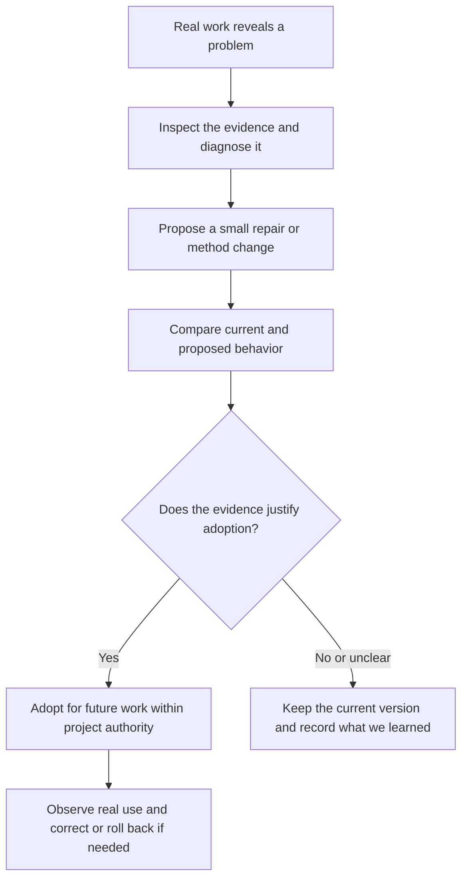

# Testing and adopting an improvement

Status: accepted design direction, with the user's explicit clarification that the session lead Astra or Fable makes the improvement-adoption decision. Loam serves research projects broadly; examples illustrate the mechanism without imposing a domain. Runtime implementation remains deferred.

Critical point: a plausible explanation of a failure must not become an allegedly proven improvement merely because the agent prefers it.

## Start with a task

Illustrative story, not work performed: a project investigates possible solutions to a research question. An approach is ruled out for a documented reason. In a later session, an agent repeats that approach. We inspect what happened and find that its handoff mentioned the failed approach but omitted why it failed.

The proposed improvement is small: include the reason an approach was rejected and the conditions under which it might be worth revisiting. We first determine whether the omission violated an existing contract, requiring an implementation repair, or whether the project's handoff method needs changing. We do not automatically rewrite a prompt whenever a task goes poorly.

## A short comparison plan

Recommendation: before running the comparison, save a small plan that makes the intended improvement and its limits clear. This is the evaluation manifest discussed earlier: an exact test plan with references to the actual inputs and outputs.

| Question | Proposed contract | Example for the handoff change |
|---|---|---|
| What problem are we addressing? | Link observed failure, affected output and diagnosis; preserve uncertainty | Repeated rejected approach; the delivered handoff omitted the rejection reason |
| What changes? | Exact current and proposed artifact revisions; unchanged governing authority | Candidate handoff renderer includes reason and revisit conditions |
| What cases will we use? | Fixed required case identities, source/memory snapshots and starting state; separate diagnostic and held-out cases when claiming generalization | Unchanged rejection reason; changed conditions that justify reconsideration; incomplete original evidence |
| What counts as better? | Case-specific criteria, unacceptable regressions and comparison method declared before results | Avoid unjustified repetition while permitting a reasoned revisit; preserve uncertainty |
| How will we judge it? | Named mechanical checks, model rubric and/or human assessment, each bound to its inputs and limitations | Check required source references; assess whether the choice to repeat or reconsider follows the evidence |
| What stays comparable? | User-selected model/effort, allowed tools and equivalent starting conditions; explicitly record unavoidable differences | Separate copies of the starting project memory, with no transfer of newly learned material between comparison groups |
| What result permits adoption? | Required complete evidence, declared assessment and configured authority; otherwise reject or remain inconclusive | Improvement supported within the tested handoff scope, without the identified regressions |

Recommendation: choose cases that could disprove the change. A blanket instruction to never repeat a failed approach would look good on the original failure but fail the changed-conditions case. Evaluating the desired behavior includes checking that the agent remains able to change its mind for good reasons.

An initial bounded reproduction can establish a specific repair. A broader claim about model behavior needs a declared repeat-trial/comparison design and enough evidence for that claim; one favorable stochastic run is not general improvement. Exact trial plans depend on the question and user-authorized limits. Inadequate evidence remains inconclusive rather than acquiring certainty from a score.

## Research outcomes are not predetermined answers

Recommendation: Loam supplies the record/execution/review mechanism. Project methods supply what constitutes relevant evidence and good work. Some properties have runnable checks. Others require source inspection, replication, a declared judgment rubric or human expertise. These judgments and their uncertainty stay visible.

For open research, do not require the agent to reach a favored conclusion. A supported negative result, a useful reframing or a justified inconclusive result can satisfy the admitted research method. Collection failure is different from a finding that the evidence is inconclusive. A reviewer or expected-answer file is not an oracle; contradictory sources can reveal a defective evaluation. Revise that evaluation through a recorded new comparison, without retroactively changing the original result.

Use captured source snapshots for a controlled replay. If fresh live research changes available evidence between runs, record that difference and qualify the comparison. It cannot silently become an isolated estimate of the method change's effect. Reference judgments and evaluation-created memories remain protected from candidate modification and ordinary project-memory activation.

## Adopting the result

Accepted: a favorable assessment produces an adoption candidate for the session lead Astra or Fable. The lead reads the evidence and decides whether to adopt, decline or revise the change within the user's authority. Reviewers/advisors inform that decision. No automatic score or background evaluator makes the adoption decision. A decision beyond existing permission needs the user's direction; no new human checkpoint is required for every small authorized repair.

Recommendation: bind the decision to the designated lead's actual session/attempt, candidate revision, comparison evidence, reason and intended activation scope. The control boundary verifies that session binding instead of accepting a payload's claim to be the lead. Without an eligible lead, retain the candidate pending a lead session. A replacement lead can decide after a current evidence handoff; it cannot simply reuse an old decision for changed inputs.

At activation, the supervisor checks the eligible lead decision, that the target's current version still matches the evaluated predecessor, that supporting evidence/assessment has not been invalidated, and that requested scope is authorized. It records the new active revision and reason together. This is validation of the lead's decision, not a competing judgment about research value. Future work uses it; already-running work changes through normal steering. Keep the prior version available, subject to present validity, for rollback. This is the purpose of the activation transaction: prevent an evaluated change from replacing a different or newly corrected version by accident.

If real use reveals harm, record the exact affected work and evidence. Correct a lesson or block affected use promptly; do not wait for a replacement method to be fully evaluated. A rollback changes the active revision for future work and preserves history. Project-local adaptation does not silently alter Loam's shared engine or export private research.

## Existing code, sources and bounded implementation work

Verified: current `bin/factory` has a `run_eval` path that iterates grader fixtures, compares verdicts and optional failing-row sets, and rejects an empty executed suite. It skips case directories lacking either required input file. Source read: `bin/factory:246`, `:256`, `:305` and the end of that loop. It is useful existing evaluation machinery, but does not implement the complete comparison plan above. No runtime evaluation was run.

Verified source basis: the saved [Claude cookbook audit](prior-design/cookbook-claude-sdk-audit.md) discusses deterministic/model/human assessment, generated candidate tests, malformed grades and incomplete populations. Anthropic's [agent evaluation guide](https://www.anthropic.com/engineering/demystifying-evals-for-ai-agents) distinguishes outcomes from agent claims, explains grader tradeoffs and combines evaluation with real-use feedback. The design adapts those principles to the already accepted local factory; it introduces no mandatory research domain or new hosted service.

Proposed implementation order and future checks, not implemented or run:

1. Add the versioned comparison-plan record using existing work/artifact infrastructure. Future generated-project command: `python3 -m unittest discover -s .loam/factory/tests -p 'test_factory_evaluation.py'`. Required missing case, changed criterion or wrong-output feedback must remain incomplete/conflicting, not successful evidence.
2. Execute isolated baseline/candidate cases through existing native-worker contracts and protected evaluators. The same fixture group must reject cross-group memory transfer and preserve inconclusive judgments. Later native trials establish real behavior; fake events cannot.
3. Add activation/rollback commands through the existing authority transaction. Future command: `python3 -m unittest discover -s .loam/factory/tests -p 'test_factory_improvement.py'`. A changed predecessor or corrected source blocks stale activation; valid activation affects future admissions only.

Canonical fixture source is `seed/.loam/factory/tests`. Each discovery run must check an expected nonempty population. These proposed Python test interfaces do not select the engine language. The first proof is a deliberately rejected adaptation with current behavior preserved, then an authorized activation and rollback fixture. General usefulness requires subsequent real use and suitable empirical evaluation.

Next discussion: how to choose the initial proving cases for the complete generated-project flow, using these contracts rather than adding more machinery.

## Design verification

Verified: current-document links, whitespace, original snapshot digests and documentation-only Git scope passed the local documentation checks. A fresh-context reviewer checked research flexibility, comparison validity, authority and scope against the accepted parent contract and reported no concrete gap within that review scope. No runtime evaluation or model experiment was performed.

Self-attack: a lucky candidate run, an omitted hard case or a changed research question could create a misleading improvement claim; the design requires the declared comparison and preserves missing/inconclusive outcomes. Real native isolation and judgment quality remain unchecked and need later probes. Only documentation changed. The user clarified existing broad research scope; no new domain feature or demonstrated quality benefit is claimed.
