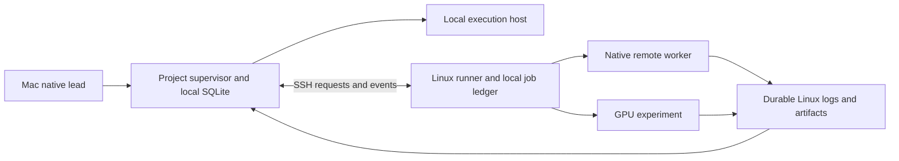

# Maintainable factory and Mac-led Linux work

Status: design proposal. The user's required workflow now includes a native session on the Mac launching and monitoring Linux agents and GPU experiments. Mac and Linux are the supported platform families, initially this Mac and `jhaveris`, with replacement machines enrolled later. Runtime implementation remains deferred.

## The everyday workflow

Recommendation: the user asks the local Astra or Fable lead to investigate an approach and run an experiment on Linux. The native lead selects the appropriate admitted method and invokes Loam's remote-work tool. The local project supervisor validates the request and sends a uniquely identified job to the registered Linux runner over SSH. The runner starts the job, records its execution and keeps its logs. The lead can monitor it from the original Mac session and examine the returned evidence.

The user can close the SSH connection or put the Mac to sleep without that act being mistaken for job failure. When the Mac returns, Loam reconnects to the existing job. It does not repeat a GPU launch just because the reply to its first launch request was lost. A cancellation requested while disconnected is shown as pending delivery, not as a stopped process.

Recommendation: one execution contract for local and remote work: submit, status, events/logs, cancel and collect. SSH is the remote transport. The same trusted execution-host implementation captures native/check output in either case. There is no remote reasoning controller choosing a second plan. The Mac native lead still reasons and decides; the supervisor validates authority; the remote runner executes admitted work and reports facts.

Remote native sessions are explicit workers launched on another machine. They are not automatically children in the local provider's native session tree, and do not inherit the local lead's adoption authority. Preserve actual remote session, model, effort and native observations. Route their findings back as evidence through the accepted root-lead decision contract.

Local native tools, including admitted Mac computer-use capabilities, continue to operate on the Mac. A method declares where each required tool runs. An agent running on Linux does not gain access to Mac GUI tools merely because its supervisor is on the Mac; it returns a request for an authorized local action through the same authority path.

## Keep maintenance small by assigning each thing one home

| Thing | Canonical owner | Maintenance rule |
|---|---|---|
| Skills, prompts and research methods | Shared seed assets and adjacent references | Preserve curated methods; load relevant bodies on demand. Version content and its supporting files together. |
| Commands and workflows | Thin native/CLI entrypoints over factory operations | A slash command and a tool call reach the same implementation. Workflow prose cannot become a parallel state machine. |
| Agents and subagents | Shared role definitions plus native bindings | Keep role purpose/inputs/evidence separate from provider invocation. Inherit admitted models/effort; detect capability gaps. |
| Plugins and tool servers | Catalogued package/dependency plus selected profile | Record source identity, capabilities, executable support and permissions. A plugin name or installed cache path is not a complete dependency. |
| Tool calls | Validated operation contract and native adapter | Check real caller origin, arguments, authority, exit/response semantics and cancellation. Retain provider-specific observations. |
| Runtime and environments | Versioned factory toolchain plus declared project environment | Qualify Node/native bindings on Mac and Linux. Pin experiment dependencies separately; record GPU driver/runtime compatibility without promising bit-identical numerical results. |
| Machine locations, accounts and secrets | Local operator bindings | Use a target name such as `gpu` in project methods; map it locally to `jhaveris` and its enrolled identity. No personal hostname, account or path baked into seed. |
| Task state and evidence | Owning project supervisor; execution facts remain with their host too | No shared live SQLite file across machines. The runner's job ledger is not a second project acceptance authority. |

Recommendation: extend the accepted curated catalog into a small compatibility manifest, not a new general plugin framework. It records the factory release, protocol version, native adapter versions, asset identities, required tools/services and environment requirements. Use exact matching releases for new Mac-to-Linux work initially. A future compatibility range requires explicit conformance evidence, not optimistic version comparison.

## The maintenance cycle

Recommendation: use the same short cycle for a prompt edit, a plugin update or a native CLI upgrade:

1. Identify the proposed change and its dependent capabilities. Preserve curated local modifications and identify upstream provenance.
2. Stage the change outside the active installation. Show changed permissions, dependencies, behavior, schemas and affected projects/targets.
3. Run the checks appropriate to that kind of change. Add a meaningful regression case for the problem being repaired.
4. Release a coherent tested bundle and let projects adopt it through the existing reviewed update path.
5. Observe real use for regressions, capture evidence and revert or repair when required.

| Change | Required evidence before activation |
|---|---|
| Skill/prompt/role | Valid references and inputs; preservation map; representative task/negative cases; independent review of changed behavior. Text validity alone does not establish usefulness. |
| Command/workflow | Correct source/input identity, argument validation, permissions, failures and replay/cancellation behavior. No text-only PASS or hidden publishing. |
| Native tool/plugin binding | Recorded native versions, configuration/tool discovery, actual root/child attribution and required native probes. |
| Runtime/protocol/storage | Package/build closure, both-host mechanical checks, version-mismatch refusal, restart and migration/restore failures. |
| GPU environment/method | Immutable experiment inputs and declared environment; bounded smoke run; checks relevant to the research claim. Larger scientific validation belongs to the project. |

Recommendation: make `status` and `doctor` logical operations available to both CLI and native tools. Status reads current work, last contact, resource use and evidence state. Doctor explains a concrete setup or compatibility failure. Neither launches a paid job, installs packages or repairs live state merely because it was called. Before admitting work, compare the actual relevant installation with its manifest. Do not re-audit every unused optional asset on every tool call.

Recommendation: initially check for maintenance on explicit request, release adoption and detected drift/failure. Produce one actionable report with affected capabilities, evidence and proposed repair. Avoid a background repair agent that silently edits skills or installs packages. Recurring checks can be added later if useful; none are enabled by this design.

## Updates and rollback during long experiments

Recommendation: stage updates while work runs, but keep active inputs, toolchains and execution protocols unchanged. Initially activate changes to a shared runner/native binding only after its affected jobs are idle. If the user needs an urgent change, explicitly stop/reconcile affected jobs or choose a separately qualified side-by-side deployment. Do not add that deployment machinery merely to avoid waiting for the first update.

New work must pass the Mac/target release handshake. A mismatch returns a precise update requirement; it does not trigger an unreviewed remote install. Old installed snapshots remain available for the work and evidence that reference them. Package/native self-updates must not mutate an admitted factory installation. Any unavoidable external service or organization-policy drift remains a declared dependency that can invalidate affected work.

Recommendation: code rollback and database rollback are different operations. Re-selecting an older runtime is allowed only if it understands the current schema/protocol. Otherwise use a tested forward repair or the accepted quiescent backup/restore procedure, preserving intervening work and remote-job reconciliation. Never restore an old database and assume the remote experiment or its external effects were undone.

## From this Mac/jhaveris to replacement machines

Recommendation: enroll each new Mac or Linux target, verify its native tools and capabilities, and record a new machine identity. An SSH alias is a location hint; changing where `jhaveris` points does not move old jobs or make the new host their owner. Replacement machines run the appropriate conformance/setup checks rather than inheriting support from a familiar hostname.

Project source, profile choices and curated assets travel through the project/release mechanism. Secrets use normal native/local setup. Large experiment data transfers only when declared; record source/artifact identity and availability. Do not copy personal caches as the factory's dependency mechanism.

Moving the project supervisor to a new Mac is an explicit handoff of authority: quiesce or reconcile the old owner, transfer a consistent protected backup, create the new owner generation and rebind known remote jobs. If the old owner is unreachable, use the documented recovery path and fence its future control before granting new control. There is no automatic competing supervisor. [Remote work contract](remote-execution-contract.md) defines this boundary.

## What makes this simple

Recommendation: retain one factory source tree, one project authority, one execution contract, one curated catalog and one update path. Add an SSH transport and a small persistent Linux runner to the existing execution host. Use the Linux service manager for process lifetime rather than inventing a daemon supervisor. No message broker, shared network database, cluster scheduler or separate remote reasoning loop is required for the stated workflow.

The concrete remote launch/offline rules and failure cases are in [remote execution](remote-execution-contract.md). [Maintenance/remote tickets](maintenance-remote-tickets.md) add the implementation obligations. All remain proposed behavior until implemented and exercised.

## Accepted offline default and next work

Accepted D-OFFLINE: the user selected mixed behavior. An already started fixed GPU job continues within its agreed resource/time limits; remote native agents stop receiving new work and default to interruption. A bounded autonomous native exception requires separate task-specific authorization. No remote actor may grant itself more time, launch another job, change model/effort or approve new access because the Mac is unavailable. An experiment needing native reasoning during execution must declare that distinction rather than disguise an autonomous agent loop as a fixed GPU command.

The [job record and operator flow](remote-job-and-operator-flow.md) now make setup, launch, monitoring, recovery and update obligations concrete. Queue-by-default with fail-fast is accepted. The user owns jhaveris for personal use; keep overlap handling simple, with routine defaults rather than a scheduling questionnaire. No multi-user scheduler is required. Next consolidate the remaining bootstrap/setup/update tickets. Queueing cannot authorize a new offline start. The user's runtime deferral remains in force.
