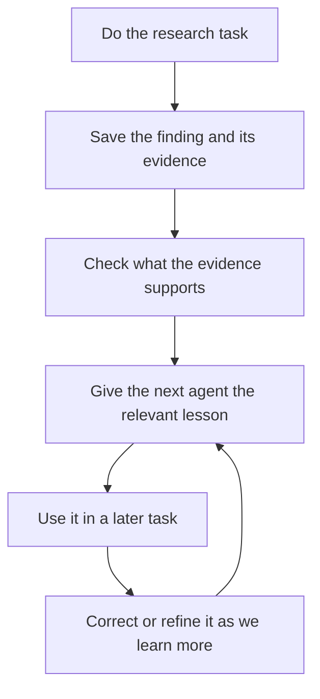

# Why memory needs a finding, a check and a handoff

This is an illustrative story explaining the proposal, not an experiment performed or a new architectural decision. The user asked for an intuitive evolving example and inline visual before further schema detail.

Recommendation: give every generated project a shared research notebook and a way to prepare a short, current handoff for its next agent. Preserve what we learned, why we believe it and when it applies. Claude Code and Codex keep their native ways of working.

Imagine we ask an agent to compare two implementations. One appears faster. In this example, investigation reveals that it reused a cached result while the other did the work from scratch. The agent reruns the comparison under matched conditions and saves the actual outputs.

The useful proposed lesson is: for this comparison, use matching cache conditions. It links to the experiment and records the circumstances. This is what the technical design called a memory proposal. It is a finding offered for future reuse, not automatically a project rule.

Before treating the explanation as reliable advice, a reviewer checks whether the saved experiment supports it. A simple recorded observation can take a lighter review route. The causal explanation in this story warrants a separate reviewer. If support is missing, the idea stays tentative.

Later, we start another performance task, perhaps with Codex after the earlier work used Claude. Loam prepares a short handoff: what the user wants now, the relevant cache lesson, its original evidence and any unfinished work. That is the context packet. A handoff delivered to an agent is distinct from evidence that it read or correctly applied the experiment.

Then the user says this new task is specifically about repeated requests, where a populated cache is part of normal use. The old experiment remains valid historical evidence. Its lesson must not become an instruction to clear caches in every benchmark. Loam retains the scope and supplies the new requirement with the old finding qualified appropriately.

During real work, we observe whether the handoff was helpful, misleading or ignored. Those observations can suggest a better benchmarking checklist. We compare the proposed checklist with the existing one on suitable tasks before making it a default. A passing task alone does not establish that memory caused the success.

The source basis is the [Claude context-engineering cookbook](https://platform.claude.com/cookbook/tool-use-context-engineering-context-engineering-tools), which distinguishes persistent notes from active conversation context, and the [OpenAI personalization cookbook](https://github.com/openai/openai-cookbook/blob/9aad95f0aa4f8e12991ef9b9201df28747860bfc/examples/agents_sdk/context_personalization.ipynb), which develops capture, consolidation and later context use. Loam's review, correction and common cross-provider handoff are engineering recommendations grounded in the user's research workflow and portability requirements. Their usefulness still needs evaluation after implementation.

The current discussion is the purpose of these responsibilities. Record fields and transaction mechanics are supporting implementation detail, not decisions the user needs to parse to understand the experience.
