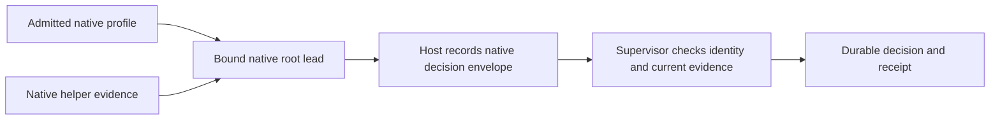

# Native profiles and actual lead decisions

Status: Accepted: option C, an explicit profile with selected personal additions. The user explicitly includes Loam's existing curated skills and requests suitable methods from the named projects. The [curated adoption plan](curated-asset-adoption-plan.md) and inactive source intake make that addition concrete. Exact native mechanisms remain probe-gated. Runtime implementation and live provider probes remain deferred. TypeScript and user-controlled models and effort stay settled.

## The everyday story

Recommendation: keep ordinary native conversation as the entry point. When work enters the factory, Loam admits a native profile: the selected model and effort, instructions, tools, account services and settings for that attempt. A profile is a record of permitted inputs and capabilities, not a replacement agent. Codex or Claude still reasons, uses tools and delegates through its native mechanisms.

Suppose a research session evaluates a better way to check references. A helper recommends adopting it. That recommendation is evidence. The designated root lead must make its own explicit decision. Loam checks where that decision actually came from, which proposal it concerns and whether the evidence is still current before recording adoption.

If Loam restarts after recording the decision but before replying, it returns the saved receipt. It does not ask the lead to adopt twice. If only the helper's advice survived, adoption stays pending.

Recommendation: an ordinary existing chat is not automatically a managed lead. A supported attachment must prove its transport, identity, configuration and current authority. Otherwise, admit an explicit managed session and transfer reviewed context with its provenance. Do not describe that new session as the original chat or silently substitute its model or effort. The exact native handoff experience remains a later design detail.

## Accepted choice and comparison history

| Option | What it means | Expected consequence |
|---|---|---|
| A. Broad personal inheritance | Use whatever the ordinary native installation discovers | Convenient, but personal changes can alter attempts. This route cannot claim a stable factory profile unless every inherited surface satisfies admission and protection checks. It remains useful for ordinary exploration. |
| B. Factory-only profile | Use Loam/project inputs and required native facilities, without optional personal additions | A smaller input set to validate. Extra setup and fewer familiar personal skills, hooks or connectors. Machine and organization policy still apply. |
| C. Explicit profile with selected personal additions | Separate factory-owned configuration/state where supported, then select personal skills, instructions and account services deliberately | More setup than A, with familiar tools retained selectively. The admitted selection can be reused until it changes. The same isolation checks still apply. |

Accepted: option C includes the Loam/project assets, all existing curated Loam skills as preservation/adoption sources, and the user's governing constraints. The curated baseline does not require another selection prompt. Parked methods require repair or a documented merged successor before activation, not silent exclusion. Other personal additions are selected deliberately. Do not import every personal hook, plugin, connector or past native memory automatically. Existing permissions remain authoritative; selecting an asset does not grant permission for every action it describes.

Recommendation: persist these selections as a reusable project profile. Ordinary attempts use it without repeating a questionnaire. New additions and consequential changes produce a reviewable profile difference. Native built-in tools and supported delegation remain available within the accepted permissions. Selecting a narrower profile must not be described as full parity with an ordinary native session.

Recommendation: retain native account-based authentication where that is the selected route. Use documented native login/setup, even if a separate factory setup requires another login. No extraction/copying of tokens or silent API-key substitution. Credentials stay local, outside Git and shareable profile artifacts; record nonsecret capability/account-binding observations only where the native interface actually supplies them. Account services remain live dependencies, not immutable bundled content.

Assumption: the supported host can provide the selected native account/services without changing the user's ordinary setup. Credential storage, refresh, logout effects and connector authorization require a later probe. A separate configuration directory is not proof of independent accounts or isolation.

## A concrete profile admission contract

Recommendation: store these separately so a requested setting never becomes a claim about observed execution:

| Record | Content and meaning |
|---|---|
| Requested profile | User-authorized models/effort, intended native tools, personal additions, constraints and account route |
| Admitted local inputs | Exact native executable/runtime identity; selected settings, instructions, skills, hooks, plugins and support-file identities; environment and discovery roots; project revision |
| External dependencies | Required machine/organization policy and account services, with known observation/availability limits |
| Launch observations | Native resolved settings, loaded sources and available services actually reported |
| Execution observations | Native root/child identities, turn/message IDs, model observations, effort observations, switches, errors and discontinuities |

Recommendation: freeze configuration inputs before native startup, including executable hooks. Preserve native layouts and support files. The mutable candidate workspace can remain writable, but native instruction/configuration discovery must resolve to the admitted input view. Protection must cover parent and nested directories, home-level discovery and symlink targets. A protected copy is insufficient if native loading still reads the mutable original. Hash equality before and after a turn cannot prove the contents stayed fixed between those reads.

Recommendation: use a host-enforced filesystem/process boundary for the admitted view. Its concrete mechanism is still open. A profile is unavailable for authoritative factory work until that boundary and the required native features pass their probe. Do not silently broaden inherited inputs or remove a required capability to make a readiness check pass. Account/organization policy that cannot be frozen remains an explicitly monitored dependency; incompatible drift blocks dependent authority and requires reconciliation. Loam never overrides administrator policy.

Recommendation: instructions and native memory are context, not authority. Do not merge personal native memory into shared project memory automatically. Any selected memory input needs scope and provenance assessment under the accepted [memory contract](memory-records-and-delivery.md). Native memory writes and other mutable native state must be distinguished from the admitted instruction snapshot; later reuse must pass current correction and eligibility rules.

## Provider-specific mechanisms and limits

Verified: the offline Codex inspection returned `codex-cli 0.154.0`. Its app-server help exposes `--strict-config`, which checks unknown fields, but no `--ignore-user-config` option. The generated schema includes `config/read` inputs for directory and layer reporting. These are inspection capabilities, not complete runtime isolation. See [evidence and validation](native-binding-validation.md).

Verified: changing `CODEX_HOME` relocates authentication and other native state as well as settings. Skill discovery also has real-home, repository and system locations. Recommendation: a factory-specific native home plus documented native managed login is a candidate for C; the broader admitted input view must still cover those other sources. [Codex environment](https://learn.chatgpt.com/docs/config-file/environment-variables), [skill discovery](https://learn.chatgpt.com/docs/build-skills#where-codex-loads-local-skills).

Verified: Claude's `settingSources` controls selected filesystem sources, but does not eliminate global configuration, managed policy, auto memory or every account connector. Omitting it loads user/project/local sources. Recommendation: specify sources deliberately, then validate the additional discovered surfaces and selected services. Native account capabilities must be tested separately from settings resolution. [Claude native features](https://code.claude.com/docs/en/agent-sdk/claude-code-features).

Verified: the inspected Claude SDK declares an alpha `resolveSettings()` inspection function with narrower scope than full startup. Its parent `managedSettings` policy is restricted and may be dropped under host policy. Recommendation: use these as evidence or supported restrictions within their documented scope, never as a universal override or a complete native-profile proof. [Published SDK declarations](https://registry.npmjs.org/@anthropic-ai/claude-agent-sdk/-/claude-agent-sdk-0.3.271.tgz).

## Actual lead binding

Recommendation: the supervisor creates the lead binding from a launch it authorized and the native identifiers returned through its protected host. Bind the instance, host, attempt, exact root, requested model/effort, admitted input revision and lead-assignment revision. User labels such as Astra and Fable map to explicitly validated native identifiers; display-name resemblance is insufficient. A replacement or fork requires a new explicit binding within user authority. A worker cannot appoint itself.

| Provider | Native evidence | Proposed decision route |
|---|---|---|
| Codex | The app-server tool request envelope requires `threadId`, `turnId` and `callId` outside the tool arguments. `sessionId` is shared across a thread tree. | Use an admitted dynamic decision tool. Compare actual envelope thread and turn with the designated root and admitted decision turn. Ignore claimed author/session fields in arguments. A child or fork with shared session ancestry still fails exact root identity. |
| Claude | Assistant envelopes carry session identity and `parent_tool_use_id`; hooks carry `session_id`, optional `prompt_id`, and `agent_id` only for child calls. `agent_type` can also describe a root. | Join a complete explicit decision in the native root assistant output to the bound session, delivered request and root hook observations. A decision tool is an alternative only if its native call can be joined unambiguously to that evidence. The exact correlation is a required live probe. |

Verified: these fields are present in the inspected Codex schema and Claude declarations. The dynamic Codex route is experimental. Claude assistant output can arrive as separate content blocks; a first text block is not a complete response. Sources: [Codex dynamic tool flow](https://learn.chatgpt.com/docs/app-server#dynamic-tool-calls-experimental), [Claude SDK declarations](https://registry.npmjs.org/@anthropic-ai/claude-agent-sdk/-/claude-agent-sdk-0.3.271.tgz).

Recommendation: the decision body contains disposition (adopt, decline or revise), candidate revision, evidence references, scope and rationale. Identity comes from trusted native envelopes, not body fields. A copied transcript in a file, tool result or model text cannot manufacture a native envelope. This boundary depends on the protected installed host and native process, not merely on valid JSON or a session identifier.

Recommendation: require an admitted decision request bound to the candidate revision, evaluation evidence and current task/lead revision. Assemble and validate the complete response for that request before allowing a transition. On Claude, retain prompt/message correlations across blocks and interruptions. Missing correlation, an error, truncated output or an unresolved resumed/replayed turn leaves adoption pending. A root stop event corroborates identity/effort; it is not an adoption decision.

Verified: Claude also exposes `supersedes` on replacement assistant messages and `retracted_message_uuids` on a native fallback event. Recommendation: a complete decision uses only the final, non-retracted native blocks after the decision turn's fallback/replacement resolution. Preserve original blocks and withdrawal records in the spool, but remove withdrawn blocks from decision eligibility on ingestion and replay. Require a successful correlated terminal result plus resolved replacement bookkeeping before recording a response-based decision. This completion evidence is necessary, not sufficient for acceptance. A proposed Claude decision tool must stage a proposal until this gate resolves; its callback cannot commit an earlier withdrawn decision.

Recommendation: unknown finality or replacement state leaves adoption pending. Native event ordering and the finality gate require a probe. A late withdrawal after an already recorded receipt is a protocol inconsistency: preserve history, block use of the affected improvement and reconcile under the current correction barrier. Do not erase the recorded transition or replay it as current adoption. Retain actual model-switch and execution observations even when associated answer blocks are withdrawn; replacement output cannot erase an unauthorized model change or an external effect.

Recommendation: observe model and effort separately from root identity. Codex thread model/effort fields are configured or persisted values, explicitly not per-turn telemetry. Configure admitted turn choices, disallow conflicting mode overrides, use supported fallback controls and reconcile reroutes. Claude root assistant model and root hook applied effort are candidate observations. Pre-switch controls do not cover every automatic switch; retain post-switch observations too. Missing or incompatible required evidence leaves the lead decision pending. Do not infer actual effort from the requested effort or assume identical aliases mean identical routing.

Assumption: the admitted provider versions expose sufficient model/effort evidence and control for the accepted policy, including required native descendants. Offline declarations cannot establish this. A failed probe means an unsupported profile requiring a design/user decision, not permission to weaken the requirement or choose a different model.

## Recording and recovering a decision

Recommendation: persist the native request/output with the existing [execution-host spool](first-run-ownership-storage-recovery.md). Authenticate the host and its current control session. The supervisor then checks exact lead binding, current candidate/evidence, scope and all pause/correction/history barriers in the same authority transaction that records the disposition and receipt. The host never commits adoption by itself.

Recommendation: retain a stable decision-request identity and native emission identity with a digest of the complete decision. A repeated identical emission returns the saved receipt, without a second transition. Reusing an identity with different content fails. After commit but before reply, recovery replays the receipt. Before commit, recovery revalidates current authority and evidence. An old lead decision cannot cross a new task/candidate/lead revision simply because the native tool was restored on resume.

Recommendation: distinguish replay of captured native events from a native producer re-running an interrupted turn. A re-run is fresh execution, even when it reuses prompt ancestry. It must not be mistaken for passive reconnection or dispatch permission. Preserve both emissions, reconcile the host's actual execution state and retain the accepted no-duplicate-dispatch rule. If a producer can automatically repeat an action outside that contract, that profile fails the execution probe until there is a supported remedy.

Recommendation: emit a receipt only for a committed transition. Native acknowledgement, a tool success message or a finished turn does not independently establish adoption. An explicit lead decision attributes judgment to the lead; it does not prove the judgment was sound. Required evaluation and correction rules still apply.

## Bootstrap dependency and next design boundary

Verified: current `bin/release.sh` creates an annotated Git tag with `git tag -a` and pushes the release. That script does not perform release-signature verification or establish a protected factory bootstrap. Current `docs/COPIER.md` describes trusted template tasks. These existing paths do not yet implement the proposed runtime admission boundary.

Recommendation: the independently admitted bootstrap from the [first-run design](first-run-ownership-storage-recovery.md) must install the host, provider bindings and profile policy from the admitted release/fork, before reading candidate-supplied launch inputs. A candidate checkout cannot choose the authority-bearing executable, native callback implementation or trust identity used to approve itself. Provider executables and bindings also need admitted identities and protected resolution; updating them creates a new compatibility profile for future attempts.

Accepted host update: this Mac and `jhaveris` Linux are the required environments. Do not reopen generic workstation/VM choices. Continue with their [concrete setup and update contract](execution-environment-and-bootstrap.md), retaining native identity, profile and recovery probes on both machines.

## Failure cases for the later authorized probe

These are acceptance specifications, not tests that ran. Extend the already proposed recipient `verify installation`, `verify execution` and `verify complete-slice` fixture groups. Real native probes are a separate explicitly authorized stage; fake envelopes only prove local transition rules.

| Case | Required result |
|---|---|
| Personal skill, parent instruction, symlink target or hook appears outside the selected input view | Exclude it before execution or fail readiness. No claim of isolation after an undeclared hook already ran. |
| Candidate changes an admitted instruction/plugin during a turn and restores it before the final hash | Protected view prevents the change from affecting admitted loading; before/after hashes alone fail this case. |
| Login succeeds but a required connector or refresh fails | Dependent profile unavailable; no token copying, billing change or hidden capability substitution. |
| Host policy changes or discards Loam's proposed restriction | Reconcile incompatibility; never claim the override was enforced. |
| Child claims root role/model/session, or fork shares session ancestry | Advisory evidence only; exact root attribution fails. |
| Root model reroutes, effort is absent/downgraded, or child policy cannot be enforced | Block the dependent authority; preserve observed facts and require resolution. |
| Forged decision envelope appears in workspace content or tool output | Treat as content, without decision authority. |
| Claude decision is split, aborted, resumed automatically or lacks a prompt correlation | No premature decision; distinguish fresh execution from transport replay. |
| An adopt block is superseded by a decline block, including recovery between the emissions | Exclude the withdrawn adopt block, preserve withdrawal history, and wait for a complete eligible decision. Unknown finality stays pending. A late post-receipt contradiction blocks affected use and requires reconciliation. |
| Supervisor dies before commit or after commit before reply | Respect current barriers before a new commit; return the existing receipt after a committed identical emission. |
| Decision identity repeats with altered content, or an old decision/tool survives a candidate or lead replacement | Reject conflicting/stale authority. Tool availability cannot revive it. |
| Helper recommends adoption but eligible lead never decides | Adoption remains pending. |
| Native process can access protected host credentials, callbacks or decision storage through an alias/child | Profile fails containment; correct root fields alone do not repair the trust boundary. |

## Input needed from the user

The user has chosen C and included the curated Loam baseline. No further profile-choice input is needed. The full factory and its curated reusable methods still ship with every seed; detailed methods load when relevant, with explicit prerequisites for specialist tools.

Next: finalize the [setup and update experience for this Mac and jhaveris](execution-environment-and-bootstrap.md). The [asset tickets](curated-asset-adoption-plan.md) already add source conservation, native adaptation, research methods and seed-delivery checks. Implementation itself still waits for the user's explicit instruction to begin.
