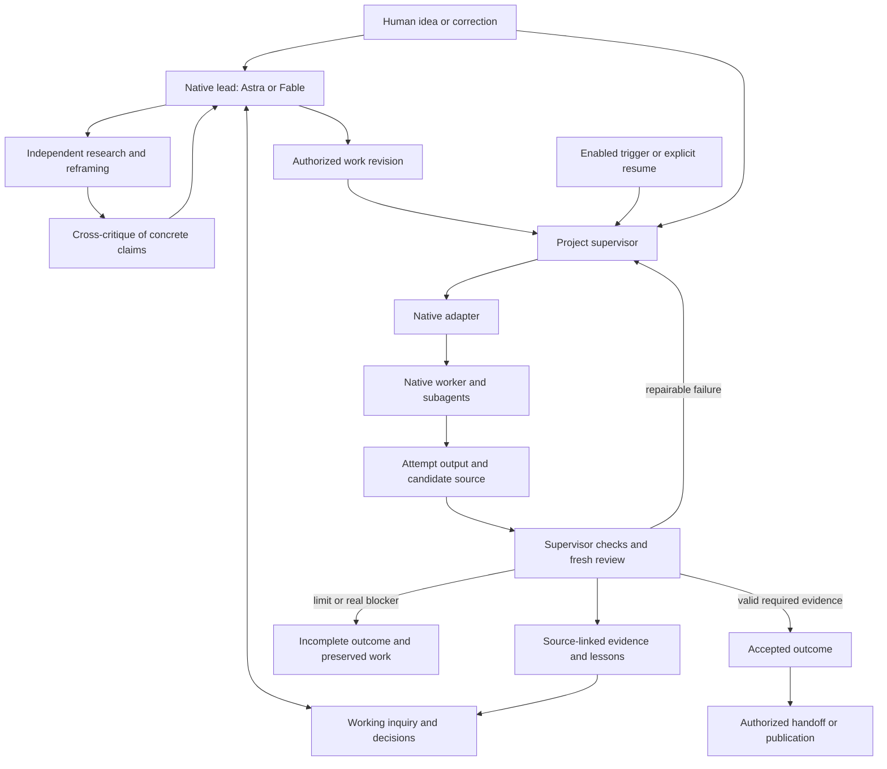
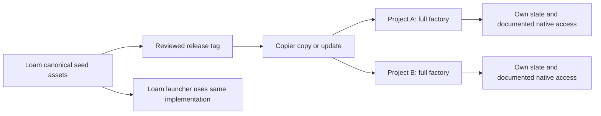

# Loam factory: living architecture design

Status: distribution, ownership, configuration, SQLite-plus-artifacts storage and record/transition direction accepted; native adapter and memory implementation design remain under discussion. Runtime implementation remains deferred.
Evidence time: 2026-09-14T00:12:37Z (local session date 2026-09-13).
Examined main: `d627bb2755ad49865f798bcb095800ddd2ad1ced`.
Historical baseline: `eed83d179a5f9423eeee209b994edb9da4d6c444`.

This document is separate from the original architecture report. See [decisions.md](decisions.md) for requirements, proposed decisions, alternatives and pending questions. See [current-evidence.md](current-evidence.md) for current source evidence and access limits. Verified means backed by a session source read or command. Likely means inferred from verified evidence. Assumption means an unverified design premise. Distribution, ownership and configuration direction is accepted as recorded in decisions.md. Remaining recommendations are proposals.

## Settled product boundary

Verified: the current request and handoff require the complete factory and supporting infrastructure in EVERY seed. Loam develops the reusable implementation. Every generated project owns a usable instance independent of the Loam checkout and undocumented personal setup. Thinking, solution discovery, delivery, recovery, evidence, memory interfaces and automation infrastructure are inherited capabilities. Domain methods activate as applicable. Credentials and private history never ship. Shipping automation does not start it.

Verified: Astra leads Codex work at the user's chosen effort, with only Astra, Sol and Terra permitted. Fable 5.1 drives Claude Code work, with only Fable 5.1 and Opus 4.8 permitted. User controls defaults and changes. Independent agents, cross-critique and synthesis are required for substantial inquiry. This session used inherited model/effort without requesting overrides.

Recommendation: make the promise concrete. A generated project can investigate an idea, decide whether it merits implementation, execute authorized work, and explain why the result is accepted or why it stopped. It can resume after interruption without relying on an author's personal machine.

## What exists and what changes

| Surface | Verified current behavior | Proposed change |
|---|---|---|
| Distribution | Copier renders only seed; seed and copier.yml are unchanged since the review. Factory assets remain outside seed. | Include the complete required payload in every render. |
| Thinking | Plugin brief preserves intent; figure-out always maps to multi-ticket Track C. Surprise-me offers expansion and analogy. | Ship the required mechanisms; separate uncertainty, work size and risk. |
| Delivery | Ticket lint, worktrees, frozen controller/checks/prompts, native workers, checks, graders, run evidence, PR preparation and partial resume exist. | Retain these responsibilities and repair acceptance, durable phase recovery and ownership. |
| Since review | Detached baseline worktree, frontier scheduling, login checks, account-limit retry, newest-cache graders, advisor/reviewer prompt changes. | Preserve useful behavior while making it project-scoped. Prompt edits are not evidence of measured improvement. |
| Completion | Main loop ignores check exit; malformed/missing Codex review can mean no blockers; cap and pass reach the same PR path. | Explicit current receipts; exhaustion stays incomplete; publication separate. |
| Native setup | Claude defaults to an Opus worker with Fable advisor/graders; environment overrides can change these. Codex uses native configuration and still invokes Claude graders. | Apply settled driver policy and audit all configurable model paths. Single-harness profiles are proposed, untested. |
| Memory | Catchup reads personal Claude memory plus local handoffs. | Shared project evidence/decisions accessible from either harness, without personal history. |

Verified: current source supports these findings (C1-C7). Historical fault injections were read, not rerun. This phase is a source audit and architecture design, not production certification.

## Recommended operating model

Recommendation: a small deterministic supervisor surrounds the native harness. Deterministic means ordinary code decides transitions from explicit inputs. The native lead owns its thinking, tools and conversation loop. The supervisor owns durable work state, required checks, recovery and acceptance. It does not select the engineering answer for the model.

These are responsibilities, not separate services. A CLI, local records, subprocesses and native adapters can supply the first implementation. A dashboard, search platform and graph database are not prerequisites.

| Owner | Responsibility | Does not establish alone |
|---|---|---|
| Human | Intent, consequential choices, model/effort policy, authorized scope and external actions | That checks passed |
| Native lead | Interpret, investigate, propose mechanisms, delegate, synthesize dissent, explain choices | Acceptance by saying done |
| Research agents | Distinct source/code inquiry, reframing and evidence-backed criticism | Truth by agreement |
| Supervisor | Admission, ownership, scheduling, receipts, required checks, retry bounds and acceptance | Scientific validity without project criteria |
| Adapter | Launch, observe, interrupt, reconcile, resume/restart, collect; declare capabilities | Guarantees absent from the native interface |
| Native worker | Implementation or inquiry within scope using native tools and subagents | Authority to rewrite governing policy or accept its output |
| Evaluator | Declared checks and fresh review of exact candidate/evidence | Independence if the worker replaced the acceptance oracle |
| Memory maintenance | Index evidence, preserve conflict, propose applicable lessons | Automatic rule promotion |

## Complete distribution and update contract

Recommendation: distribute source through Copier first. Keep one canonical generic runtime under proposed `seed/.loam/factory/`, required shared skills under existing `seed/.agents/skills/`, and operator guidance under proposed `seed/docs/factory/`. A generated `bin/factory` launcher supplies the project root. A root development launcher invokes that same canonical implementation against Loam. Runtime root and project root are distinct inputs. Relocating only today's executable is insufficient.

Proposed mandatory payload: supervisor, native adapters, check runner/result schemas, role rubrics, inquiry/decision/ticket workflows, discovery/surprise-me mechanisms, evidence/memory interfaces, model-policy profiles, setup diagnostics, stop/recovery controls, disabled trigger definitions, compatibility metadata and redistribution notices. Required skill bodies and support files resolve from the payload or explicit pinned dependencies. Personal plugin caches cannot be the required runtime resolver.

Recommendation: keep managed runtime, project configuration, shareable decisions and private operational state separate. Updates replace managed runtime through reviewed Copier changes. Target behavior, not established by current update tests: project decisions/configuration persist. Seeds contain empty stores, not Loam runs. Existing runs pin runtime, admitted policy, instructions and evidence schema; updates apply to new runs. Resume an old run with its compatible snapshot or report an explicit compatibility blocker. No implicit live-state migration.

Recommendation: use a declared external local state root, scoped to a local project instance. Worktrees share an instance. New clones receive new instances and empty operational state. Logical project identity travels with decisions but grants no execution ownership. A small local registry associates a checkout's Git common directory with the instance. Relocation/export is explicit. One executing host per instance is the initial proposed topology, not a settled product limit.

Workers receive read-only admitted inputs and an attempt output directory. The supervisor validates and promotes outputs into authoritative state. Workers must not write policy, frozen runtime or acceptance records. An outside-checkout path or file hash does not enforce this boundary; setup probes must prove the actual native sandbox or execution identity blocks forbidden writes. Git common-dir state is less attractive because workers already require selected Git write access.

| Alternative | Benefit/tradeoff | Recommendation |
|---|---|---|
| Canonical source in seed | Complete inspectable payload using existing releases; requires update ownership discipline | Start here. |
| Canonical root runtime plus generated seed mirror | Less disruptive migration; adds generation/equality contract | Credible fallback, never hand-maintained copies. |
| Pinned external package | Independent releases; another publication/resolution dependency | Defer until benefits justify it. Launcher plus install-later instructions is insufficient. |
| Optional plugin | Useful specialized additions | Rejected for required factory. Native plugin registration can expose shipped assets. |

## Idea to inquiry, decision and ticket

Recommendation: preserve the original request separately from the lead's interpretation. Infer work type. A known repair can go directly to a bounded ticket. Consequential uncertainty opens an inquiry. Size, uncertainty and risk remain separate.

An inquiry's shared minimum is **question, method, evidence and conclusion**. Add alternatives, dissent, decisions and next action where useful. Method may be literature comparison, code inspection, proof/counterexample work, instrumentation or experiment. Early ideas need not arrive with a complete empirical protocol.

Substantial inquiry starts with independent investigations before sharing a preferred conclusion. Exchange claims for cross-critique. Include a reframing pass: overlooked assets, simpler explanations, a useful analogy and where it breaks. The lead synthesizes and preserves material disagreement. Several summaries of one paper remain one source origin. Agreement is not acceptance evidence.

An engineering decision records selected and rejected alternatives, reasons, constraints and authority. A ticket follows when behavior, boundaries and observable checks are concrete. An inquiry can finish with a negative conclusion or justified uncertainty. Failure to obtain required evidence remains incomplete unless the admitted method permits limited-access synthesis with explicit limits.

Recommendation pending user decision: project files own inquiry/decision/ticket content; GitHub is a linked projection and event source. Current repository policy makes accepted issues authoritative. This changes authority and is not assumed approved. If GitHub remains authoritative, workers use pinned local snapshots and offline edits are proposals. Either model requires revision checks: stale edits become conflicts, not silent last-writer-wins updates.

### Example: an idea that may not become a feature

Assumption: in a new analysis project, the user asks, “Would caching make our analysis loop faster without changing results?” This is illustrative, not a claim about Distbench or an existing project.

1. The lead records the question and output-equivalence constraint. Investigation authority is not automatic implementation or paid-experiment authority.
2. Investigators inspect timing/code, candidate libraries and original sources. A critic studies invalidation. Reframing asks whether upstream repeated work can be removed.
3. Evidence links source revisions and reading scope. If evidence cannot distinguish cacheable work from external waiting, the lead proposes instrumentation.
4. Once authorized, an instrumentation ticket defines behavior/checks. The supervisor freezes requirements, starts a native worker and checks its candidate. Repairable failures return exact evidence to the worker.
5. A project-specific measurement method is admitted separately. Command, inputs and environment produce raw artifacts with their own run identity. Working instrumentation does not prove a speedup.
6. If external waiting dominates, conclude caching is unsupported for the tested workload. Save evidence and stop that feature direction. No cache ticket is needed.
7. If justified, an engineering decision creates a cache ticket with output-equivalence and project-defined performance checks. The factory does not invent timing methodology.
8. A later input-format correction becomes a steering revision. Old observations persist but cannot accept revised work without checking applicability.

### Example: interrupted ordinary repair

Assumption: an authorized ticket repairs malformed input handling. The worker returns a candidate, but the check process crashes before writing a result. The supervisor records ERROR and incomplete evaluation. On restart, it reconciles the prior attempt and completes the pending check against the same candidate. A required reviewer then returns malformed output: review ERROR, bounded retry. Exhaustion preserves useful work but does not mark it ready. Only valid current receipts permit acceptance. Publication remains separately authorized.

## Completion, state and recovery

Recommendation: keep execution, acceptance and publication independent. Research interpretation is separate again. Proposed execution states: ready, running, evaluating, waiting-external, needs-input, stopped-limit, failed, cancelled, finished. Acceptance: pending, accepted, incomplete, rejected, superseded. Publication: absent, draft, proposed, published. These are design vocabulary, not existing CLI commands.

| Proposed record | Minimum useful content |
|---|---|
| Work revision | Original intent reference, scope, authority, method/check definitions, constraints, revision identity |
| Run | Project/instance, work revision, baseline, runtime/profile, authorized actions and limits |
| Attempt | Unique stage execution, native session/process, ownership generation, start/end/error |
| Receipt | Producer, attempt, candidate, method/check revision, exit/result status, artifacts and hashes |
| Finding | Exact candidate/criterion, evidence, blocking state, repair or authorized dismissal |
| Steering | Ordered correction, received/delivered/applied state, affected scope/evidence |
| Acceptance | Current receipts, required coverage, open findings, decision and cause |
| Publication | Authorized action/destination, submission identity, external receipt, reconciliation |

Recommendation: checks report PASS, FAIL, ERROR, UNAVAILABLE or SKIPPED. Every required check must be PASS. Optional checks can be skipped with a reason. Required-tool absence cannot count as passing. Validate process exit and complete result coverage; reject missing, duplicate, stale or malformed results.

Acceptance binds to the exact candidate, work revision, criteria and relevant environment. Native turn completion or PR existence is insufficient. After integration, check the final candidate rather than combine passes from different commits. Findings persist across restart until repaired, superseded by evidence or dismissed with authority. Caps do not dismiss findings.

Recommendation: extend frozen snapshots to all effective role/skill/config dependencies. Workers can add implementation tests, but changing admitted acceptance tests needs review and a new criterion revision. Frozen commands executing worker-rewritten tests are not independent evidence. Evaluators inspect those changes and use protected behavioral fixtures where applicable.

Recommendation: all candidate-controlled execution, including test imports, builds and lifecycle hooks run by evaluation, must lack write access to authoritative state and governing policy. Do not run those processes with supervisor authority or publication credentials. The protected supervisor observes process exit/output and writes receipts itself; candidate-reported PASS text is input to validate, not an authoritative receipt. Add a fixture where candidate code attempts to alter policy or acceptance during evaluation.

Recommendation: usage records distinguish known spend from unknown-cost calls. Persist retry counts and the user-selected per-call, per-run and cumulative limits across restarts. Limits stop work honestly; they do not downgrade models.

Recommendation: start with a single-writer file journal, exclusive process ownership and atomic phase receipts. Select a transactional local store if interruption tests expose complicated recovery. Keep storage behind a small interface. Partially written logs never establish phase completion.

On restart, acquire ownership, inspect the last committed transition, reconcile the prior process/provider job, then continue the incomplete stage. Lock expiry is not proof the prior worker stopped. Do not run a competing worker on the same candidate while ownership is uncertain. Late output from an older ownership generation is preserved as history but excluded from current acceptance.

For external submissions, save intent and a submission key before sending. Retries reuse that key for the same logical submission. Intentional repeated measurements get new run identities. Reconcile unknown receipts before retry. Without a safe provider reconciliation mechanism, report an unknown-submission blocker. Cancellation request and acknowledgment remain separate.

Steering is captured immediately with an acknowledgment of when it can take effect. Check before each stage and before acceptance/publication. Urgent invalidating changes request interruption; others enter a safe boundary. Delivery is not proof of application. Criteria changes invalidate affected acceptance evidence without deleting observations. A model suggestion cannot expand authorized scope.

## Native adapters and model policy

Verified: official Codex docs and installed help support noninteractive execution, structured events and explicit session resume. App-server offers steering, but its command remains documented experimental. Recommendation: checkpointed native jobs and explicit session IDs form the common initial contract; prototype richer live steering separately (N1-N2).

Verified: Claude supports programmatic output/resume. Interactive teammates differ from headless subagents. Bare mode skips substantial native context and subscription authentication. Recommendation: explicitly load and verify project capabilities under the selected path; do not adopt bare mode solely for portability (N3-N4).

Proposed adapter responsibilities: prepare/readiness, launch, observe, interrupt, reconcile, resume/restart and collect. These are Loam responsibilities, not invented vendor APIs. Declare support for live steering, nested agents, session recovery, termination, usage and effective-policy observation.

Recommendation: ship complete Claude-only, Codex-only and combined profiles. Cross-provider review is configurable, not an undocumented second subscription. Today's Codex path must lose its unconditional Fable-grader dependency to pass this target. Reviewer independence depends on distinct context and exact evidence, not merely provider identity.

The settled driver policy governs profiles. Do not retain an Opus driver merely because today's worker defaults to it. Delegation stays within user-selected roles/models/effort. Record requested and resolved settings plus observability limits. No automatic fallback/downgrade. Audit reviewers, subagents, advisors, prompt hooks and memory workers too.

Verified: Claude goal evaluation defaults to an incompatible small model unless overridden and judges conversation without tools. Recommendation: configure and probe or disable such paths before advertising policy compliance. Do not promise visibility into vendor-internal routing. Exact identifiers and role effort mappings remain user-controlled and subject to compatibility checks (N5).

## Adapting the setup to Astra and Fable

Verified: the handoff and annotation corrections require model-specific adaptation of prompts, skills, roles, hooks and workflows, beyond checking allowed models. Preserve the original request and corrections as the authority; a derived worker brief cannot silently change the objective.

Recommendation: ship a bounded setup-audit workflow for each selected driver. Inventory the effective instruction surface, including nested role prompts, examples, generated worker messages, hooks, native configuration and fallbacks. Check current official model guidance when proposing a change, then connect each proposed edit to an observed failure or an explicit compatibility requirement. Produce a reviewable diff with evidence, intended benefit and rollback. Do not modify policies or active runs automatically.

Evaluate a candidate profile on representative framing, substantial team inquiry, long implementation, later correction and recovery cases. Retain cases outside prompt tuning. Compare completion, unsupported claims, preserved user constraints and correction effort against the existing profile; shorter prompts or cheaper runs are not the objective. Keep the previous profile available for rollback. Exact profile changes require source checks and later authorized native evaluations; neither was performed in this phase.

## Shared memory and evidence

Recommendation: separate authoritative current rules, accepted decisions and historical lessons. Shared memory is a small entry point with source-linked project records. Native memory remains a useful local aid but not a required cross-harness handoff.

A lesson records circumstances, action, observation, interpretation, sources, applicability and invalidation. Retrieval checks applicability against current code/config. Superseding a conclusion preserves observations and dissent. Consolidation indexes and proposes; it cannot grant policy authority. Shareable records are deliberately published; private logs remain local. Seeds start empty.

Recommendation: ordinary file search first. Add lexical/semantic indexing after a demonstrated retrieval failure. Evaluate capture, retrieval and application separately: can a fresh session recover evidence, find the source and reject an incompatible old lesson? Domain methods remain project-owned. No universal GPU, data-split or statistical contract.

## Progressive implementation design and acceptance

These are future fixture scenarios, not commands or tests already implemented or run. Before implementing a slice, bind it to exact runnable repository checks.

| Order | Bounded slice | Evidence required before expansion |
|---|---|---|
| First | Full source payload and fake-worker ticket in generated project | Hide Loam checkout and personal skills; every required asset resolves; mechanical run needs no model account or enabled scheduler. |
| Next | Truthful acceptance in that slice | Silent nonzero check, partial/missing/duplicate result, malformed review, stale receipt and exhausted retry remain unaccepted; evaluator-launched candidate code cannot alter policy/receipts. |
| Next | Instance identity, ownership and recovery | Equal tickets in separate projects isolated; same-instance competing launches do not overlap; interruption resumes pending stages only. |
| Next | Native profiles and steering | Each harness preserves native capability and model/permission policy; repair, resume, correction and stop pass authorized live probes. |
| Next | Driver-specific setup audit | Attributable prompt/skill/role/hook/workflow diff preserves intent; held-out task cases validate behavior; previous profile can be restored. |
| Next | Inquiry and shared memory pilot | Negative/inconclusive work completes honestly; either harness resumes; incompatible lesson rejected. |
| Next | Trigger and external-job integration | Duplicate event causes no duplicate work; unknown receipt reconciles or blocks; cancellation acknowledged; no cross-project account/timer mutation. |
| Release gate | Every project kind and update/onboarding | Mandatory payload in every seed; no private history; documented prerequisites; decisions/config preserved; old snapshot resume verified. |

Recommendation: this sequence reduces risk without redefining the product. Broad release waits for the whole required capability. Fake-worker tests establish mechanical behavior, not native-model quality. Packaging and truthful completion should be designed together so the first slice proves both independence and honest acceptance.

## Open decisions and next step

Pending user choice: local authoritative records versus GitHub authority with snapshots. Recommendation favors local records for portability and review beside code. Other proposals to examine progressively: exact internal paths, single-harness profiles, initial single-host topology, staged/live steering, file/transactional state, and authority over changed acceptance tests.

Assumptions needing probes: clean native config/auth loading, controllable auxiliary models, state protection, session interruption/resume, updates with retained run snapshots, and shared memory usefulness. Detailed discovery routing and final memory backend remain deferred.

Next, under the accepted distribution boundary: develop project configuration before proceeding through native interfaces, state transitions, checks, recovery, steering and the complete example. Record authority remains pending but does not block independent investigation. See [grounding-record.md](grounding-record.md) for the completed package reading and current-code refinements.

## Grounding refinements

Verified: the complete review folder, including PDF, image and JSON, is now covered in grounding-record.md. The independent audits identified separate obligations for distribution, effective native loading and update preservation. Existing smoke tests do not establish the latter two.

Accepted direction: retain canonical seed source after comparing the permitted generated-mirror and pinned-package alternatives against the full dependency graph. Require admission of the exact linted ticket revision, an explicit worker-output permission contract and candidate-bound checks after evaluator execution. Controller-only fake-child tests are an early probe; the end-to-end proof must also run from a generated project independent of Loam.

## Distribution implementation detail

See [distribution-design.md](distribution-design.md) for the current source-placement comparison, ownership model, update sequence, proposed retirements and future runnable acceptance contracts. The user permits redesigning/replacing existing components. Distribution and ownership direction is now accepted; project configuration is the active discussion. Runtime implementation remains deferred.

## Accepted distribution; configuration discussion

Verified: the user accepted the distribution and ownership recommendations. D-DISTRIBUTE, D-OWNERSHIP, D-UPDATE and D-REPLACE in decisions.md record the scope. Remaining mechanisms are still proposals. See [configuration-design.md](configuration-design.md) for the next bounded discussion.

## Loop and memory implementation coverage

Verified: the user accepted the configuration direction and asked to proceed, explicitly confirming memory and loop engineering coverage. See [loop-design.md](loop-design.md). Memory will cover source-linked records, capture/retrieval, applicability, invalidation and reviewed learning. Loop engineering will cover adapters, stage transitions, checks, retries, ownership, persistence, recovery and steering. Proposals for improving prompts/roles/workflows connect the two; no automatic policy promotion.

## Original-source grounding and next design layers

See [reference-reading.md](reference-reading.md) for exact reading coverage and limits, [source-informed-design.md](source-informed-design.md) for adopt/adapt/reject choices, and [loop-design.md](loop-design.md) for source-informed native lifecycle, recurring discovery, recovery and the complete example. The source review reopens stale rejections without treating external implementations as drop-in dependencies. Memory records and retrieval design are developed in [memory-design.md](memory-design.md). These additions remain proposals within the accepted distribution and configuration direction. Runtime implementation remains deferred.

The next bounded design discussion is [durable state and recovery](state-design.md). SQLite operational state plus ordinary evidence files and one supervising owner per local instance are now accepted architecture; later crash validation remains required. This does not change project-owned knowledge or make database state authoritative over accepted project decisions.

The current detailed step is [records and transitions](records-and-transitions.md): what the store records, which actor can change it, how requirements are revised and how current evidence permits acceptance. The task/check record for this step is [records-step-checks.md](records-step-checks.md).

The next step is [native adapter design](native-adapter-design.md). Research inquiry, solution discovery and team deliberation are first-class tasks in the common envelope. Current native interfaces determine execution mechanisms; prior research resources inform orchestration and evidence; engineering judgment connects them to Loam's accepted operational contract.

## Cookbook-grounded connection and workflow baseline

The expanded source audit is integrated in [cookbook-integration-design.md](cookbook-integration-design.md). The [practice registry](cookbook-practice-registry.md) records individual adoption dispositions, actual native mapping, seed ownership and future checks; [current-code map](cookbook-current-code-map.md) identifies what existing responsibilities change. [INDEX coverage](cookbook-index-coverage.md) and the provider source audits preserve exact read scope rather than treating catalog inventory as full source reading.

Recommendation: retain the native app-server/streaming-SDK bridge direction. Add a shipped work-method catalog, premise/population checks, explicit required-child admission and native identity binding, separate advisor/independent/adversarial roles, recall of consequential dismissals, one continuation owner, and authentic steering. Real teams retain their native surface; required managed guarantees are not weakened to fit it. Native goals, Workflow replay, summaries and graph indexes cannot accept work. Memory implementation is the next detailed discussion, building on these evidence and lifecycle interfaces.
