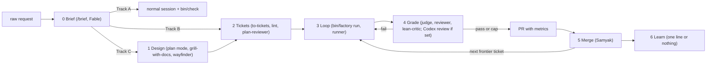

# Loam Factory: architecture

The factory takes a raw request to a merged pull request through unattended loops and independent Fable graders, on Loam and, after F8, on projects Loam seeds.
This file is the one home of the stage table, the single sources of truth, the standing do-not-touch list, the model rules, and the placement table.
The brief and ticket formats live in `CONTRACT.md`, the supervisor in `LOOP.md`, the build order in `ROADMAP.md`, the evidence in `../research/INDEX.md`.
Everything here describes the target; a thing that exists at the time of writing (2026-09-07) says so.

## Design rules

- Deterministic steps run in code; judgment steps run in a model; one human checkpoint at PR merge.
- A known command is code, not an agent: anything a ticket can name as a command runs in the supervisor.
- The agent that does the work never grades the work; graders run fresh, read-only, on frozen prompts, on a different model from the worker.
- What Samyak does not want is written down as firmly as what he wants: Out of scope in every brief and ticket, Do not touch per ticket, ADRs from the grill, and the lean-critic on every diff.
- One ticket, one worktree, one branch, one run directory; parallel runs gated by `MAX_PARALLEL` (`LOOP.md`).
- One directive has one home; a duplicate is a bug.
- Every harness component is a dated bet on a model weakness and must justify its keep after each upgrade: remove one at a time and replay the graders.
- When Samyak does not know the solution, the factory proposes before it asks: options with evidence first, then the grill picks.

## Stages

| Stage | Input | Actor, model, effort | Samyak does | Output | Gate to next |
|---|---|---|---|---|---|
| 0 Brief | raw request | Fable 5.1 high, interactive, `/brief` (F5) | corrects the echoed brief, accepts | Track A: nothing. Track B: one ticket. Track C: a design issue whose top section is the brief | A exits; B to stage 2; C to stage 1 |
| 1 Design (Track C) | design issue | when the brief is `Mode: figure-out`, `surprise-me` in panel mode and `research` subagents first; then Fable plan mode with Opus Explore subagents; `/plan-review` blind on Fable, whose elegance gate writes two competing designs before a verdict; `grill-with-docs` with `domain-modeling` writes ADRs; `wayfinder` when unknowns remain; lean-critic on the design issue | reacts to the options, answers the grill, approves | design issue body (brief, destination, deliverables, constraints, proof, no implementation detail), ADRs in `docs/adr/`, map if used | review verdict recorded, ADRs committed |
| 2 Tickets | design issue, or the one Track B ticket | Fable runs `to-tickets`; issue bodies use the ticket contract; `bin/factory lint` (F2); `plan-reviewer` by hand and lean-critic once over the breakdown | approves the breakdown | GitHub issues, native blocking edges, label `ready-for-agent` | lint exit 0, `plan-reviewer` pass |
| 3 Loop | one ticket | `bin/factory run <issue>` on the runner (F1): round 0, then worker rounds on Opus 5 medium or `codex exec` | nothing; may run `bin/factory stop`, or edit the issue body and relaunch | branch, commits, a run directory | checks exit 0, clean tree, do-not-touch clean |
| 4 Grade | diff and evidence | Fable medium judge, reviewer, lean-critic, read-only, fresh, frozen per run; Codex review stage when the ticket sets it | nothing | JSON verdicts, PR with metrics and merge checklist | judge pass and no blocking finding, or the grader-round cap with a backlog |
| 5 Merge | PR | Samyak with `bin/runner bin/factory status`; `claude ultrareview --json` optional on high risk | ticks the merge checklist, merges | merged main; the PR's `Closes #N` closes the ticket | human merge, never the loop |
| 6 Learn | `bin/factory status` | the manager session (rule in `LOOP.md`) | nothing | a `CLAUDE.md` line, a lint rule, or nothing | none |

## Single sources of truth

- The GitHub issue body is the only ticket text; an addendum is an edit to the body, never a comment; the loop reads the body only.
- The design issue body is the only home of the brief and the design once accepted.
- Each rubric lives in its grader file only; no doc restates a rubric (a build ticket may name target row names).
- Loop state lives in the run directory (`LOOP.md`); the PR body carries the per-ticket metrics; the manager session holds no state.
- The stage table lives here only; its "Samyak does" column is the runbook.
- Research lives in `../research/` with one index.

## Working-file whitelist

`.superpowers/<slug>/` may hold `BRIEF.md` and `DESIGN.md` as drafts until accepted, and nothing else.
No `PLAN.md`, `NOTES.md`, `BACKLOG.md`, or scope file is created per effort.

## Standing do-not-touch list

Every ticket's Do not touch section starts from this list and may add paths.
It may exempt a listed path only with an `Except:` line naming a path its Goal creates or rewrites; nothing else leaves the list.
The supervisor execs its frozen copy of `bin/factory`, so a ticket that edits the factory takes effect on the next run.

- `.claude/settings.json`, `seed/.claude/settings.json`, and every deny list
- `seed/.claude/hooks/`, `seed/.codex/`
- `seed/bin/`
- `VERSION`, `bin/release.sh`, `.github/workflows/`
- `bin/factory`, `bin/factory.d/`, and any grader file

Scope beyond the ticket goal outside this list is a judge finding, not a stall.

## Models and roles

- Every reviewing or judging agent is a fresh Fable 5.1: judge, reviewer, lean-critic at medium; the round-0 doable/unmeetable call at low; the plan-reviewer at high (F0 sets its frontmatter).
- Opus 5 does exploration, retrieval, and implementation only: loop worker at medium, Explore subagents.
- Brief and design sessions are Fable 5.1 at high, interactive.
- Never Sonnet or Haiku; never high or above for a loop worker; any flag that defaults to Haiku is overridden or unused; every `Agent` call names its model.
- The one named exception: Codex may be the worker (`worker: codex`) or an added reviewer (`codex-review: yes`); the Fable graders always run.

## Where things live

| Thing | Home | Reaches a seeded project |
|---|---|---|
| Graders | `cultivation/marketplace/sam-cc-setup/agents/`: `lean-critic.md` exists; `judge.md` and `reviewer.md` move there in F1 | through the plugin, or `bin/loam-attach.sh` |
| `/brief` skill | `cultivation/marketplace/sam-cc-setup/skills/brief/` (F5) | through the plugin |
| `bin/factory`, `bin/factory.d/` | Loam `bin/` (F2, F6, F1) | not until F8 |
| `evals/` | Loam root (F6) | no |
| Design docs | `docs/factory/` | no |
| Research | `docs/research/` | no |
| Runs | the runner, outside every checkout (`LOOP.md`) | n/a |

Placement follows `../ASSET-LAYERS.md`.
Preconditions live in `LOOP.md`; `bin/factory status` checks them.

## Metrics

The PR body is the metrics home: rounds, spend, wall time, first failing grader, permission denials per round, and the merge checklist.
Expected saving over lean-v3 is the stall rounds; the per-round grader cost is unchanged.
Criteria written in advance, measured on the first four factory tickets:

- operator actions from voice note to a running loop on Track B: at most 3
- operator actions after the PR opens: at most 1 once F9 lands
- stalls whose first failing grader row is scope: 0 (baseline 3 of 4)
- rounds lost to environment failures: 0 (baseline 2)
- SKIP lines per round: 0
- median rounds to PR: at most 5 (lean-v3 median)
- judge fails citing a worker-written measurement: 0 (S2 had at least four)
