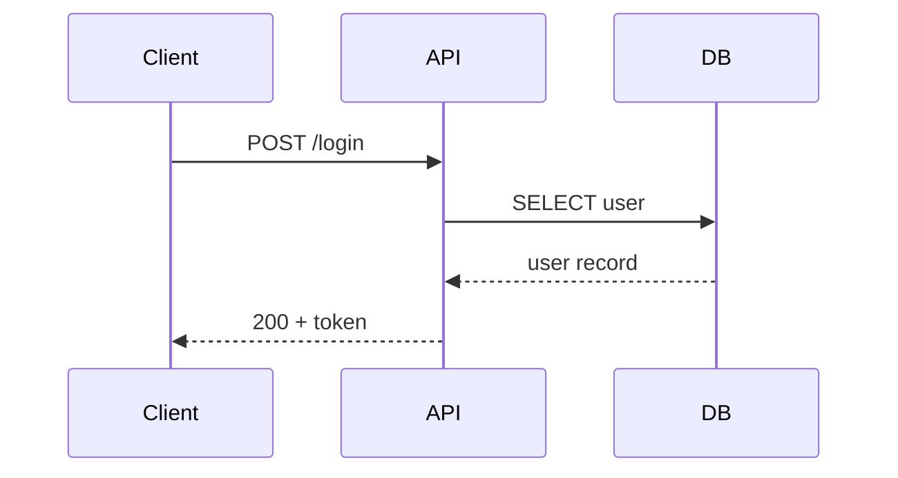
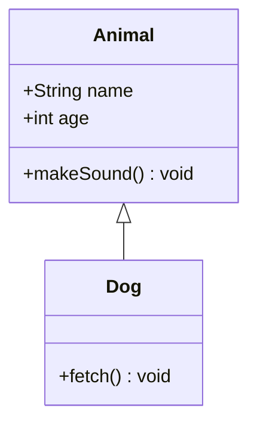
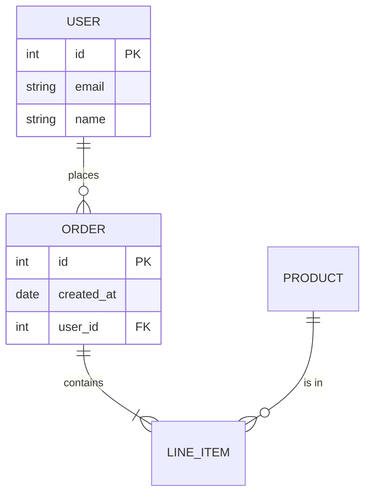
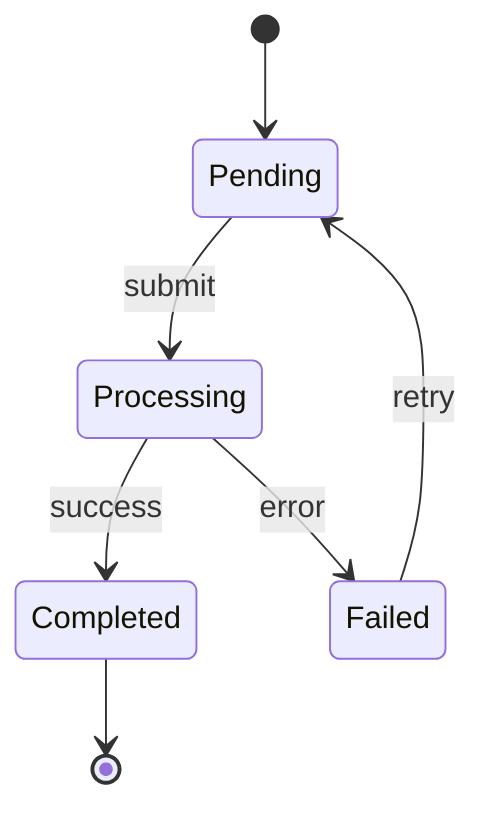
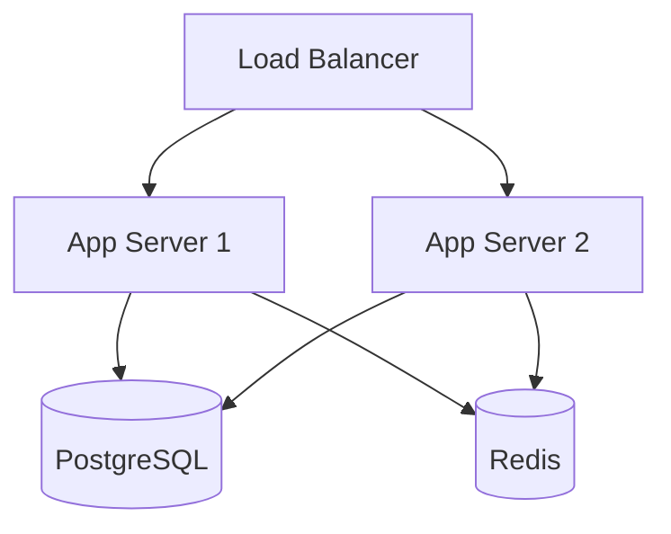
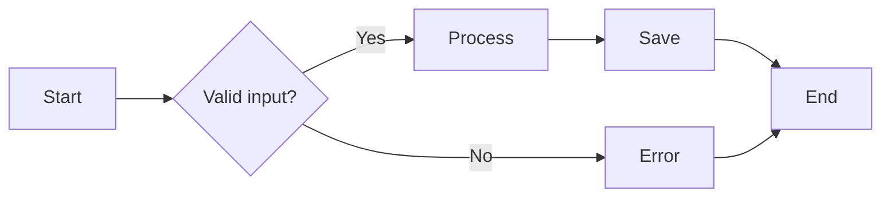
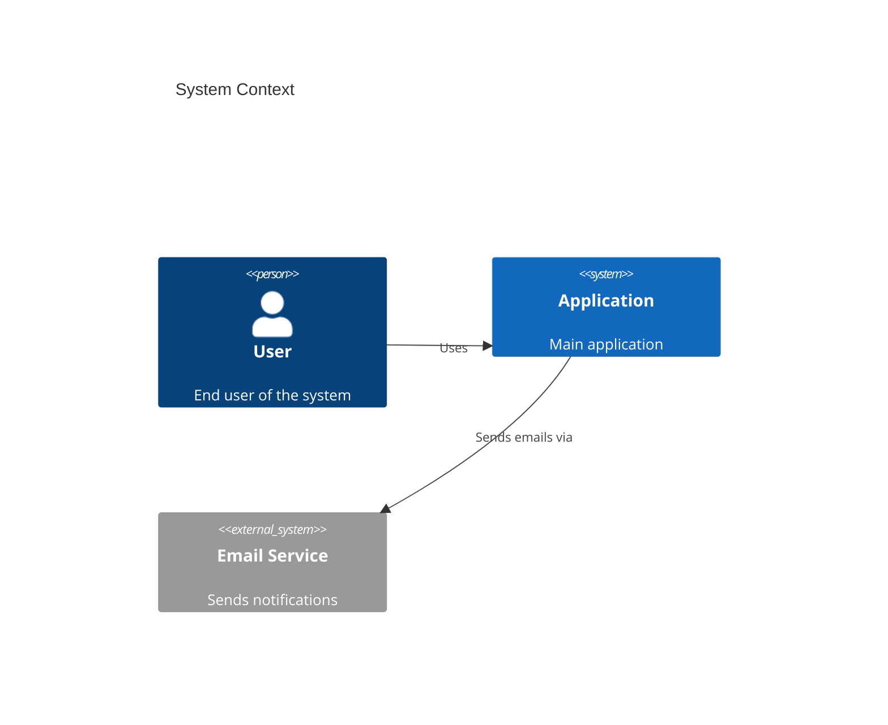
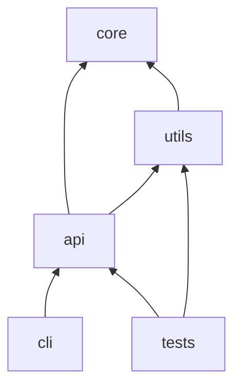

# Diagrams Reference

Per-backend syntax templates, CLI flags, and example invocations.

## Mermaid Templates (for `render` subcommand)

### Sequence Diagram


### Class Diagram


### ERD (Entity Relationship)


### State Diagram


### Architecture / Flowchart


### Flowchart (Process)


### C4 Context Diagram


### Dependency Graph


## pyreverse (for `extract` subcommand)

### CLI Flags

| Flag | Purpose | Example |
|------|---------|---------|
| `-o mmd` | Output as Mermaid | `pyreverse -o mmd mymodule` |
| `-o dot` | Output as Graphviz DOT | `pyreverse -o dot mymodule` |
| `-o puml` | Output as PlantUML | `pyreverse -o puml mymodule` |
| `-d <dir>` | Output directory | `pyreverse -o mmd -d docs/diagrams mymodule` |
| `-p <name>` | Project name (used in output filename) | `pyreverse -p myproject mymodule` |
| `-c <class>` | Single class + dependencies only | `pyreverse -c MyClass mymodule` |
| `-a N` | Ancestor depth (0 = none) | `pyreverse -a 2 mymodule` |
| `-s N` | Association depth | `pyreverse -s 1 mymodule` |
| `--filter-mode=ALL` | Include all classes | Default behavior |

### Output Files

pyreverse produces two files by default:
- `classes_<project>.mmd` — class hierarchy diagram
- `packages_<project>.mmd` — package dependency diagram

### Example Invocations

```bash
# Full module extraction
pyreverse -o mmd -d docs/diagrams -p myapp src/myapp

# Single class with 2 levels of ancestors
pyreverse -o mmd -d docs/diagrams -c UserService -a 2 src/myapp

# Package-level dependencies only
pyreverse -o mmd -d docs/diagrams --filter-mode=PUB_ONLY src/myapp
```

## Gemini Image Generation — mcp-image (for `visualize` subcommand)

Backend: [shinpr/mcp-image](https://github.com/shinpr/mcp-image) via `npx -y mcp-image`.
MCP server name in config: `image-gen`.
Single tool: `generate_image`.

### generate_image Parameters

| Parameter | Type | Default | Purpose |
|-----------|------|---------|---------|
| `prompt` | string (required) | — | Image description |
| `fileName` | string | auto | Output filename (no extension) |
| `quality` | string | `"balanced"` | `"fast"`, `"balanced"`, or `"quality"` |
| `aspectRatio` | string | `"1:1"` | `"1:1"`, `"16:9"`, `"9:16"`, `"4:3"`, `"3:4"` |
| `imageSize` | string | `"1K"` | `"1K"`, `"2K"`, `"4K"` |
| `inputImagePath` | string | — | Absolute path to edit an existing image |
| `useGoogleSearch` | boolean | false | Ground generation in web search |

Output is saved to the directory configured by `IMAGE_OUTPUT_DIR` (set to `${PWD}/docs/diagrams` in `.mcp.json`).

### Prompt Tips

The server auto-optimizes prompts via a Subject-Context-Style framework, so focus on
technical content rather than artistic direction:

1. **Name concrete components**: "FastAPI backend", "PostgreSQL database", "Redis cache" — not "backend" and "database"
2. **Describe relationships**: "connected via REST API", "reads from", "publishes events to"
3. **State the diagram type**: "software architecture diagram", "data flow visualization"

Good: "A software architecture diagram showing a FastAPI backend connecting to PostgreSQL via SQLAlchemy ORM, with a Redis cache layer and Celery task queue, with labeled arrows showing data flow."

Bad: "Show me the system architecture" (too vague)

## mingrammer/diagrams (for `arch` subcommand)

### Python API Patterns

```python
from diagrams import Diagram, Cluster, Edge
from diagrams.aws.compute import EC2, Lambda
from diagrams.aws.database import RDS, ElastiCache
from diagrams.aws.network import ELB, CloudFront
from diagrams.onprem.client import Users
from diagrams.programming.framework import FastAPI
from diagrams.programming.language import Python

with Diagram("Web Service", show=False, filename="docs/diagrams/arch-web-service",
             outformat="png", direction="LR"):
    users = Users("Users")
    with Cluster("AWS"):
        lb = ELB("Load Balancer")
        with Cluster("Application"):
            app1 = EC2("App 1")
            app2 = EC2("App 2")
        db = RDS("PostgreSQL")
        cache = ElastiCache("Redis")

    users >> lb >> [app1, app2]
    app1 >> db
    app2 >> db
    app1 >> cache
    app2 >> cache
```

### Common Providers

| Provider | Import Path | Common Nodes |
|----------|------------|--------------|
| AWS | `diagrams.aws.*` | EC2, RDS, S3, Lambda, ELB, SQS, SNS |
| GCP | `diagrams.gcp.*` | GCE, CloudSQL, GCS, Functions |
| Azure | `diagrams.azure.*` | VM, SQLDatabase, Blob |
| On-prem | `diagrams.onprem.*` | Nginx, PostgreSQL, Redis, Docker, K8s |
| Programming | `diagrams.programming.*` | Python, FastAPI, React, NodeJS |
| Generic | `diagrams.generic.*` | OS, Device, Storage |

### Key Parameters

| Parameter | Purpose | Example |
|-----------|---------|---------|
| `show=False` | Don't auto-open the image | Always use in scripts |
| `filename` | Output path (no extension) | `"docs/diagrams/arch-name"` |
| `outformat` | Output format | `"png"` or `"svg"` |
| `direction` | Graph direction | `"TB"`, `"BT"`, `"LR"`, `"RL"` |

### Edge Styling

```python
# Labeled edge
app >> Edge(label="SQL", color="blue") >> db

# Dashed edge
app >> Edge(style="dashed") >> cache
```

## Example Skill Invocations

```
/diagrams extract src/myapp
/diagrams render sequence "user authentication flow with JWT tokens"
/diagrams render erd "users, orders, products with relationships"
/diagrams render c4 "e-commerce platform context"
/diagrams visualize "how the microservices communicate in our system"
/diagrams arch "FastAPI app with PostgreSQL, Redis, and Celery on AWS"
/diagrams show me the class hierarchy of the auth module
```
